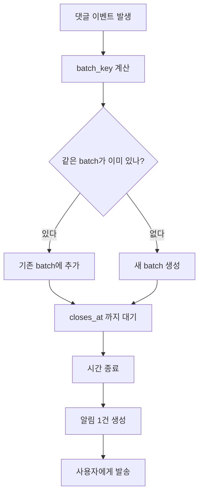

## 알림 시스템에서 큐 적체가 발생하면 어떻게 해야할까?
- 무조건 재시도하는 경우 좋지 않음. 격리 + 우선순위 + 확장 + 완화
1. 큐를 분리하기
    -  푸시, SMS, 이메일을 같은 큐에 넣으면 안됨 -> 이건 책에서도 설명했음.
2. 큐에 우선순위를 두어야 한다.
    -  OTP, 결제, 보안 알림 처럼 지연에 민감한 알림은 `최우선 순위의 큐` 로 보내야한다.
    - 마케팅성 알림은 `low prioriy queue ` 로 발송해야함.
    - 적체시 저 우선순위의 알림부터 늦추거나 중단할 수 있는 기능이 있어야함.
3. 작업 서버 자동 확장
    - 모니터링 대상은 단순 큐 길이보다는 queue lag, 가장 오래된 메시지 대기 시간, 초당 처리량 (RPS), 실패율 임.
    - 해당 값이 임계치를 넘으면 워커 수를 자동으로 늘릴 수 있게 해야한다.
    - ** 다만, 서드파티 API  를 사용하는 경우 rate limit ** 도 고려해야함 
4. 재시도는 별도의 DLQ 가 있어야 한다.
    - retry queue 와 dead letter queue 를 두고, 일정 횟수 이상 실패시 격리 하고 운영자 알림이 가능해야한다. 
5. 백프레셔와 축소 전략
    - 적체가 심한 경우 producer 에서 요청을 늦추거나
    - 같은 사용자에게 짧은 시간 내 여러 개 가는 알림은 묶어서 보내는 `coalescing` 전략을 사용한다.
    - 마케팅 알림 처럼 중요하지 않은 것은 TTL 이 지나면 폐기 가능

### 큐에 우선순위 두기
- 메시지에 별도의 숫자 우선순위를 두는 것 보다는 `큐를 아예 분리` 하는 방식이 더 간단함.
```java
  enum Priority { HIGH, NORMAL, LOW }

  record Notification(String userId, String message, Priority priority) {}

  class NotificationProducer {
      void send(Notification n) {
          switch (n.priority()) {
              case HIGH -> enqueue("notif.high", n);
              case NORMAL -> enqueue("notif.normal", n);
              case LOW -> enqueue("notif.low", n);
          }
      }
```

- 하나의 브로커에 논리적인 큐를 3개를 두는 것이라고 보면 됨.

### 작업 서버 자동 확장?
- 브로커의 확장보다는 작업 서커의 확장개념
- 브로커
    - 메시지를 받아서 `큐에 저장` 하고 `꺼내가게 해주는` 시스템  
    - Rabbit MQ 카프카 SQS 
- 작업 서버 (worker server)
    -  브로커에서 메시지를 `가져와서 실제 일을 처리` 하는 서버
    - APNS FCM SMS 이메일 서비스로 전송하는 역할
- 대체로 알림 시스템에서 적체의 1차 원인은 대개 실제 발송 처리 속도가 느린거, 작업 서버를 늘리면 효과가 난다고함
- 큐 서버를 늘리는게 아니라 작업 서버를 늘리는게 1순위라고함.

#### 백프레셔 / Coalescing / TTL 정리
- 백프레셔는 시스템이 감당 가능한 양만 받도록 `producer 쪽 속도를 늦추는 것`이다.
    - 예: 마케팅 알림은 잠시 막고, OTP/결제 알림만 계속 받는다.
- coalescing 은 `같은 사용자에게 짧은 시간 안에 가는 비슷한 알림을 1건으로 묶는 것`이다.
    - 예: 좋아요 10개를 각각 보내지 않고 `10명이 회원님의 게시물을 좋아했습니다`로 합친다.
- TTL 폐기는 `유효 시간이 지난 알림은 보내지 않고 버리는 것`이다.
    - 예: 마케팅성 알림이나 짧은 수명의 이벤트 알림은 늦게 가는 것보다 폐기하는 편이 낫다.
- 세 전략의 목적은 같다.
    - 큐 적체 때도 중요한 알림은 살리고, 덜 중요한 알림은 늦추거나 합치거나 버려서 전체 시스템이 무너지지 않게 하는 것.

### Coalescing 쉽게 이해하기
- coalescing 은 `비슷한 알림을 바로 보내지 않고 잠깐 모아서 1개로 합쳐 보내는 것`이다.
- 목적은 2가지다.
    - 사용자에게 알림이 너무 많이 가지 않게 하기
    - 큐에 쌓이는 메시지 수를 줄이기
- 예를 들어 5분 동안 같은 게시글에 댓글이 10개 달렸다면:
    - 합치지 않으면 알림 10개
    - 합치면 `회원님의 글에 댓글 10개가 달렸습니다` 1개



- 여기서 중요한 값은 2개다.
    - `batch_key`: 어떤 알림끼리 묶을지 정하는 기준
    - `closes_at`: 언제까지 모을지 정하는 시간
- 즉, `같은 사용자에게 가는 비슷한 이벤트를 일정 시간 동안 모았다가 한 건으로 보내는 것`이 coalescing 이다.

#### 어떤 알림을 묶고, 어떤 알림은 바로 보내는가?
- coalescing 은 `조금 늦어도 괜찮은 알림`에만 사용해야 한다.
- `묶으면 안 되는 알림`
    - OTP, 결제 승인, 보안 경고, 로그인 알림, 주문 실패 같은 것
    - 이런 알림은 몇 초만 늦어도 사용자 경험이 나빠질 수 있어서 즉시 보내야 한다.
- `묶어도 되는 알림`
    - 좋아요 여러 개, 댓글 여러 개, 팔로우 여러 건, 커뮤니티 활동 요약, 마케팅 알림
    - 이런 알림은 짧은 시간 동안 모아서 1건으로 보내도 의미가 유지된다.
- `최신 상태만 남기면 되는 알림`
    - 배송 상태 변경, 진행률 업데이트 같은 것은 여러 개를 다 보내기보다 최신 상태 1건만 보내는 편이 낫다.
- 시간을 너무 길게 잡으면 문제가 생긴다.
    - 예를 들어 댓글 알림을 1시간 동안 모으면 사용자는 `왜 이제 왔지?` 라고 느낄 수 있다.
    - 따라서 coalescing 은 항상 `지연 허용 시간` 안에서만 해야 한다.
- 시간 창 예시
    - 소셜 알림: 30초 ~ 5분
    - 덜 급한 활동 요약: 10분 ~ 1시간
    - 마케팅/추천: 하루 1회 digest 도 가능
