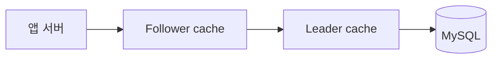
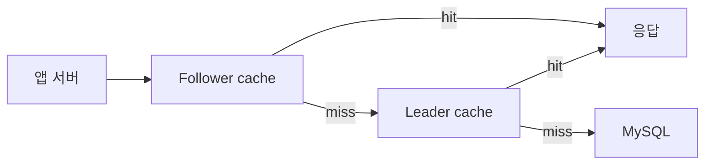
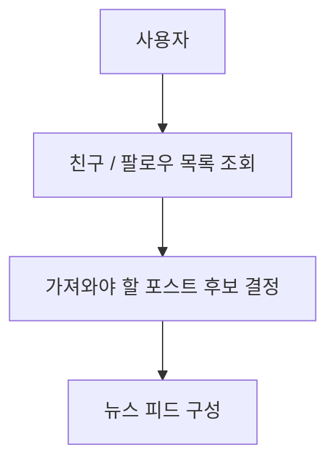

# 11장 TAO 설명

## TAO 가 뭐냐

- TAO 는 메타 / 페이스북에서 소셜 그래프를 다루려고 만든 저장 계층이라고 보면 됨
- 핵심은 `누가 누구와 연결되어 있는지` 를 빨리 찾는거임
- 사용자, 포스트, 페이지 같은 실제 데이터와
- 친구, 좋아요, 댓글 같은 연결 정보를 같이 다룸

### 한 줄로 보면

- MySQL 위에 올린 `관계 조회 특화 캐시 + 저장소 계층` 느낌

---

## 왜 이런게 필요했나

- 페이스북은 `관계 조회` 가 많음
    - 내 친구는 누구지?
    - 이 글에 누가 좋아요 했지?
    - 내가 팔로우한 사람은 누구지?
- 이런건 일반 key-value 캐시만으로 처리하기 점점 어려워짐

---

## TAO 에서 보는 데이터 2종류

### 1. object

- 실제 엔티티 데이터
- 예:
    - 사용자
    - 포스트
    - 댓글
    - 페이지

예시 느낌

```json
{
  "id": 1001,
  "type": "USER",
  "fields": {
    "name": "Alice",
    "city": "Seoul"
  }
}
```

### 2. association

- 엔티티끼리의 연결 정보
- 예:
    - 친구
    - 좋아요
    - 댓글 연결
    - 작성함

예시 느낌

```json
{
  "id1": 1001,
  "type": "FRIEND",
  "id2": 1002,
  "time": 1700000000
}
```

- 뜻은
    - `1001 번 사용자` 와
    - `1002 번 사용자` 가
    - FRIEND 관계라는 뜻

좋아요도 비슷함

```json
{
  "id1": 1002,
  "type": "LIKE",
  "id2": 2001,
  "time": 1710000000
}
```

- 뜻은
    - `1002 번 사용자` 가
    - `2001 번 포스트` 에
    - 좋아요를 눌렀다는 뜻

---

## 결국 TAO 는 뭘 빨리 하려고 만든거냐

- object 하나 읽기
    - 예: 사용자 정보 가져오기
- association 하나 확인하기
    - 예: A 가 B 를 친구 추가했는가
- association 목록 가져오기
    - 예: 이 사람 친구 목록
    - 예: 이 글 좋아요 목록
    - 예: 이 포스트 댓글 목록
- 개수 세기
    - 예: 좋아요 수 몇개?

### 중요한 포인트

- 범용 그래프 DB 느낌보다는
- `SNS 에서 자주 쓰는 조회 패턴만 빠르게 처리`
  이쪽에 가까움

---

## 구조는 대충 어떻게 생겼나



- 앱 서버가 바로 DB 를 치는게 아니라
- 일단 캐시 계층을 먼저 거침
- follower cache 에 있으면 거기서 끝
- 없으면 leader cache 로 감
- 그래도 없으면 MySQL

### follower cache / leader cache 를 쉽게 풀면

- `follower cache`
    - 앱 서버가 제일 먼저 붙는 캐시
    - 읽기 요청을 최대한 여기서 끝내려고 둠
- `leader cache`
    - follower 에 없을 때 그 다음 가는 캐시
    - MySQL 쪽에 더 가까운 계층

### 왜 2단계로 나누냐

- 캐시 하나에 다 몰아넣으면
    - 그 캐시 자체가 너무 커지고
    - 요청이 너무 많이 몰려서
    - 캐시가 병목이 될 수 있음
- 그래서
    - follower cache 에서 1차로 받고
    - leader cache 에서 한 번 더 받고
    - 마지막에만 DB 로 가는 구조를 둔거임
- 즉 이유는 `DB 보호` + `캐시 자체 병목 완화`



- follower 에 없더라도 leader 에 있으면 DB 까지 안감
- 여러 follower 가 같은 데이터를 찾을 때 leader 가 중간에서 받아줄 수 있음

---

## MySQL 은 버린게 아님

- TAO 가 MySQL 을 완전히 대체한게 아님
- MySQL 은 실제 영구 저장소 역할
- TAO 는 그 앞에서
    - 캐시도 하고
    - 관계 조회도 빠르게 해주고
    - 데이터 접근을 단순화하는 계층
  으로 보면 됨

---

## 뉴스 피드랑 연결하면

- 뉴스 피드도 결국
    - 누구 글을 가져와야하지?
    - 내 친구 / 팔로우 목록은 뭐지?
  같은 관계 조회가 중요함
- 그래서 TAO 같은 구조가 잘 맞는거



---

## 샤딩도 같이 들어감

- 데이터가 너무 많으니까 여러 shard 로 나눠서 저장함
- 쉽게 말하면 데이터를 여러 조각으로 찢어서 여러 서버에 분산하는거임
- 한 서버에 다 몰리는걸 줄이려고 하는거임

---

### 한 줄 정리

- `TAO = 페이스북에서 친구/좋아요 같은 연결 정보를 빠르게 읽으려고 만든 관계 중심 저장/캐시 계층`

---

## 참고 링크

- Meta Engineering, `TAO: The power of the graph`
  - https://engineering.fb.com/2013/06/25/core-infra/tao-the-power-of-the-graph/
- USENIX 논문, `TAO: Facebook's Distributed Data Store for the Social Graph`
  - https://www.usenix.org/system/files/conference/atc13/atc13-bronson.pdf
