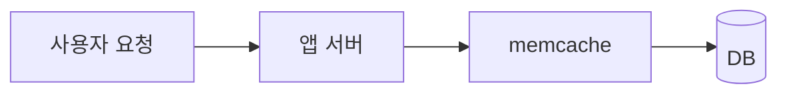
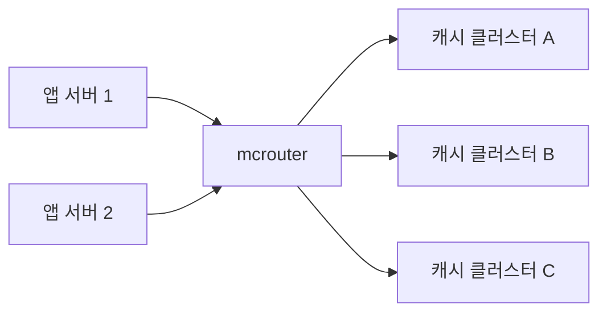
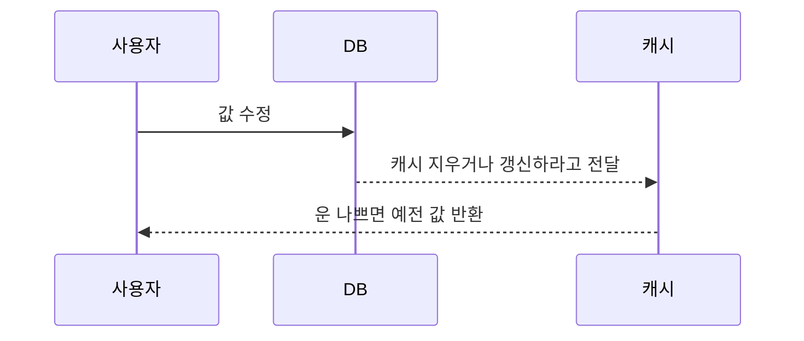
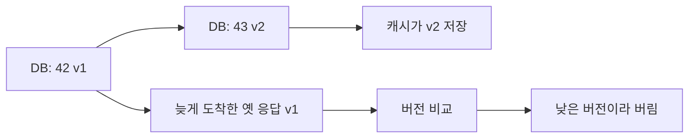
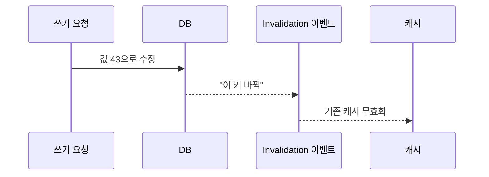
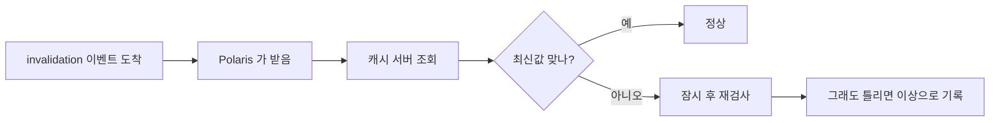
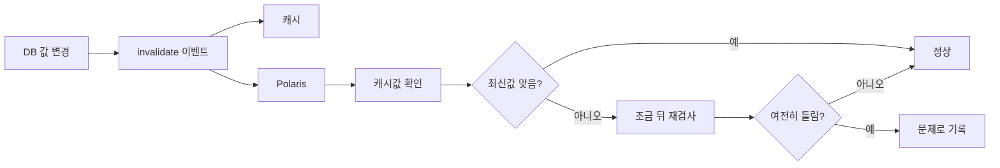

# 11장 추가질문

## 메타 / 페이스북은 캐시를 어떻게 썼나?

### 결론부터

- 처음에는 그냥 `DB + memcache` 느낌이었을거임
- 근데 페이스북은 일반 서비스랑 다르게
    - 친구 관계
    - 좋아요 관계
    - 댓글 관계
  처럼 `연결 관계 데이터` 가 너무 많음
- 그래서 그냥 일반 캐시만으론 점점 버거워졌고
    - `mcrouter`
    - `consistency 관리`
  같은 걸 붙여서 더 복잡하게 가져감
- `TAO` 는 별도 파일인 `11장 TAO 설명.md` 에 따로 정리함

### 용어부터 쉽게

- `memcache`
    - 그냥 엄청 자주 읽는 값을 메모리에 올려두는 캐시라고 보면 됨
- `mcrouter`
    - 캐시 서버가 너무 많아졌을 때 앞에서 길 안내 해주는 놈
- `consistency`
    - DB 값이랑 캐시 값이 서로 안틀리게 맞추는 것
- `invalidate`
    - 캐시 값이 낡았을 때 지우거나 새로고침 해야한다는 뜻

### 처음에는 이런 느낌

- 이건 되게 단순함
    - 캐시에 있으면 캐시에서 꺼내고
    - 없으면 DB 에서 읽는거
- 보통 서비스 초반엔 이런 방식 많이 씀

### 근데 왜 이걸로 안됐냐

- 페이스북은 그냥 글 본문만 읽는 서비스가 아니고
    - 내 친구는 누구지?
    - 이 글에 누가 좋아요 했지?
    - 내가 팔로우한 사람은 누구지?
  이런 조회가 엄청 많음
- 즉 `값 조회` 보다 `관계 조회` 가 많아진거임
- 이럴땐 그냥 캐시에 값 몇개 넣는 식으로는 점점 힘들어짐

### mcrouter 는 뭐냐

- 캐시 서버가 적으면 앱 서버가 직접 붙어도 됨
- 근데 메타처럼 캐시 서버가 엄청 많아지면
    - 어디로 보내야하지?
    - 장애난 서버는 어떻게 피하지?
    - 어떤 기준으로 나누지?
  이런게 너무 복잡해짐
- 그래서 앞에 `mcrouter` 를 둠

### mcrouter 는 그냥 캐시 안내원 느낌

- 앱 서버는 그냥 mcrouter 에 던지고
- mcrouter 가 뒤에서 어느 캐시로 보낼지 정리해주는거임

### consistency 는 왜 중요하냐

- 캐시가 빨라도 값이 틀리면 의미가 없음
- 예를 들어
    - DB 에서는 좋아요 수가 43으로 바뀌었는데
    - 캐시는 아직 42일 수 있음
- 그러면 사용자는 틀린 값을 보게 됨

### 이 문제는 이런 느낌

- 메타는 이런 문제를 줄이려고
    - 버전 관리
    - invalidate 흐름 관리
    - Polaris 같은 관측 도구
  를 같이 쓴거임

### 이걸 좀 더 쉽게 풀면

#### 1. 버전 관리

- 데이터에 버전 번호를 붙이는거임
- 예를 들어
    - 좋아요 수 42 = `version 1`
    - 좋아요 수 43 = `version 2`
- 그러면 캐시 입장에서는
    - version 1 은 오래된 값
    - version 2 는 최신 값
  이라고 판단 가능함
- 그래서 늦게 도착한 예전 응답이 있어도
    - `아 이건 version 이 더 낮네`
    - `최신값 못덮게 막아야겠다`
  이런 식으로 동작할 수 있음

- 결국 버전은 `나중에 도착했다고 최신은 아니다` 를 구분하기 위한 숫자라고 보면 됨

#### 2. invalidate

- invalidate 는 `이 캐시 값 낡았으니까 믿지마` 라고 알려주는 이벤트임
- DB 값이 바뀌면
    - 캐시 값을 바로 새 값으로 덮거나
    - 일단 지워버리고 다음 읽기때 다시 채우게 할 수 있음
- 메타 글 기준으로는 이런 invalidation 이벤트가 비동기로 흐르는데
- 이 과정에서 순서가 꼬이거나 늦게 도착하면 stale data 가 생길 수 있는거임

- invalidate 자체는 어렵게 볼 필요 없음
- 그냥 `캐시 비워라/갱신해라` 신호라고 보면 됨

#### 3. Polaris

- Polaris 는 메타가 만든 `캐시 값이 진짜 맞는지 검사하는 감시자` 느낌임
- 공식 글 기준으로 Polaris 는
    - invalidation 이벤트를 받음
    - 그 다음 캐시 서버들에 직접 물어봄
    - 아직 옛값이면 바로 끝내지 않고 조금 뒤 다시 확인함
- 왜 다시 확인하냐면
    - 막 바뀐 직후에는 잠깐 늦을 수도 있어서
    - 진짜 오류인지, 잠깐 지연인지 구분해야 하기 때문임

- 메타 글에 나온 포인트 중 하나는
    - Polaris 가 무조건 바로 DB 까지 가서 검사하지는 않는다는거임
- DB bypass 조회는 비싸니까
    - 일단 몇 번 재확인하고
    - 그래도 이상하면 더 깊게 본다고 이해하면 됨

#### Polaris 를 진짜 더 쉽게 보면

- DB 값이 42 에서 43 으로 바뀌었다고 해보면
- 캐시도 빨리 43 이 되어야 정상임
- 근데 분산 시스템이라 어떤 캐시는 잠깐 42 를 들고 있을 수도 있음
- Polaris 는 여기서
    - `잠깐 늦은건지`
    - `진짜로 잘못된 상태인지`
  를 구분하는 역할을 함

### 순서대로 보면

1. DB 값이 바뀜
    - 예: 좋아요 수 `42 -> 43`
2. invalidate 이벤트가 날아감
    - 뜻: `야 이 캐시값 낡았음`
3. Polaris 도 그 이벤트를 받음
4. Polaris 가 캐시한테 직접 물어봄
    - `너 지금 43 들고있냐?`
5. 아직 42 면 바로 장애로 보진 않음
    - 막 바뀐 직후라 잠깐 늦었을 수도 있으니까
6. 조금 있다 다시 확인함
7. 다시 봐도 42 면
    - 아 이건 잠깐 늦은게 아니고
    - 진짜 stale data 문제라고 보는거임

### 그래서 Polaris 는 결국 뭐하는 놈이냐

- 캐시를 직접 저장하는 놈은 아님
- 캐시를 직접 고치는 놈도 아님
- `캐시가 진짜 최신 상태인지 감시하는 검사기` 에 가까움

#### 4. 그래서 이 3개가 같이 필요함

- 버전 관리만 있으면
    - 최신/옛값 구분은 되는데
    - invalidation 이 아예 안왔는지, 운영 중 어디가 꼬였는지는 알기 어려움
- invalidate 만 있으면
    - 이론상 맞아보여도
    - 실제로 캐시에 틀린 값이 남았는지 모를 수 있음
- Polaris 만 있으면
    - 문제는 볼 수 있지만
    - 구조적으로 막는 장치는 아님
- 그래서 메타는
    - `버전으로 충돌 막고`
    - `invalidate 로 낡은 캐시 치우고`
    - `Polaris 로 실제 이상 여부를 계속 관측`
  하는 식으로 가져간거임

### 결국 메타 사례에서 볼 포인트

- SNS 는 그냥 캐시 하나 붙인다고 끝이 아님
- `관계 조회` 가 많으면 그 관계에 맞는 구조가 필요함
- 캐시 서버가 많아지면 라우팅 계층도 필요함
- 빠른 것 만큼 `값이 안틀리는 것` 도 중요함

### 참고 링크

- Meta Engineering, `TAO: The power of the graph`
  - https://engineering.fb.com/2013/06/25/core-infra/tao-the-power-of-the-graph/
- Meta Engineering, `RAMP-TAO: Layering atomic transactions on Facebook’s online graph store`
  - https://engineering.fb.com/2021/08/18/core-infra/ramp-tao/
- Meta Engineering, `Introducing mcrouter: A memcached protocol router for scaling memcached deployments`
  - https://engineering.fb.com/2014/09/15/web/introducing-mcrouter-a-memcached-protocol-router-for-scaling-memcached-deployments/
- Meta Engineering, `Cache made consistent`
  - https://engineering.fb.com/2022/06/08/core-infra/cache-made-consistent/
