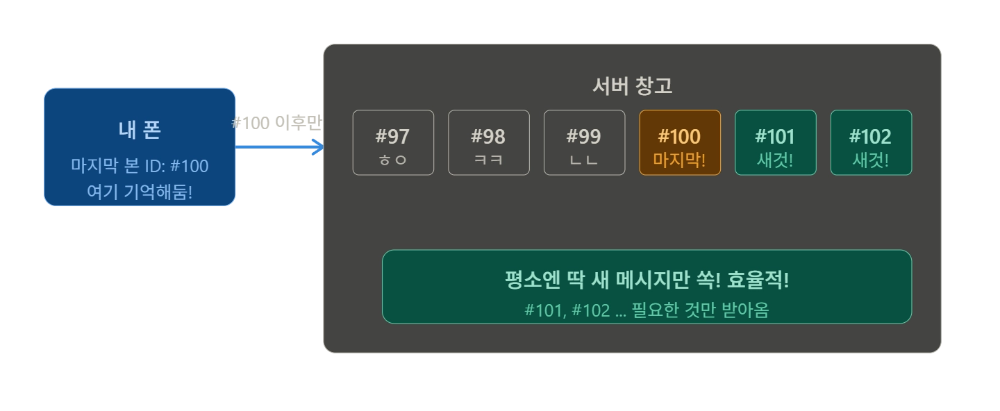
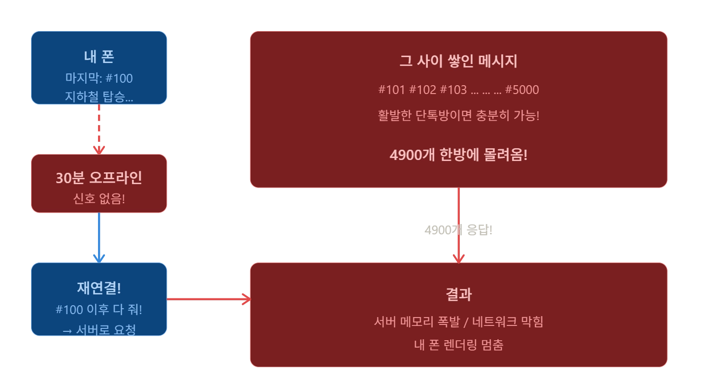
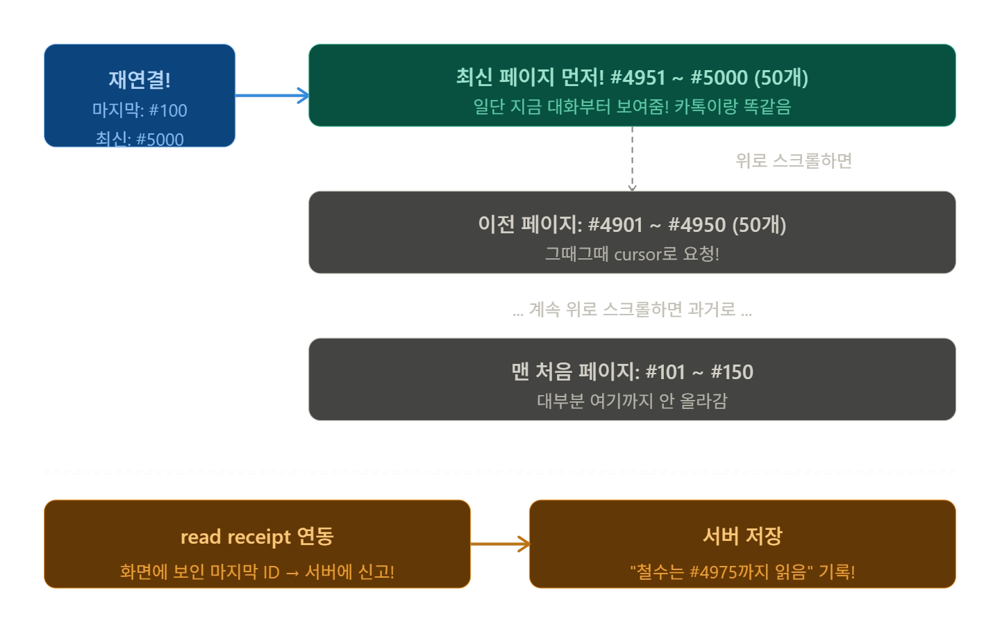
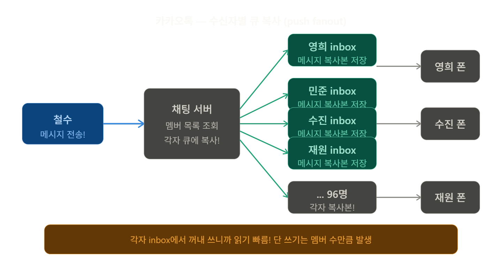
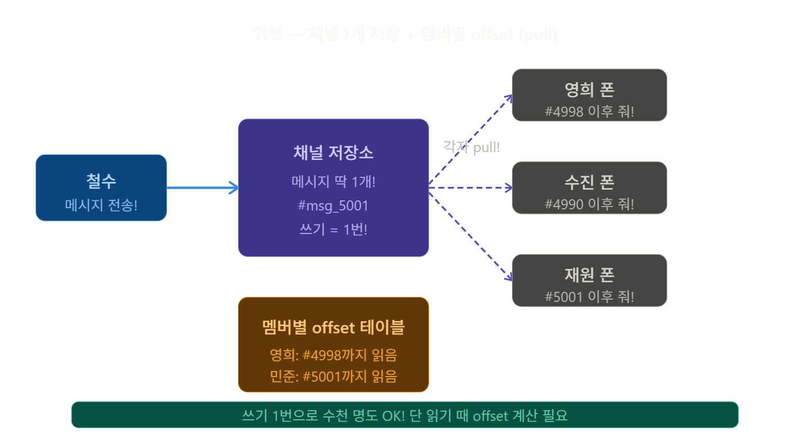
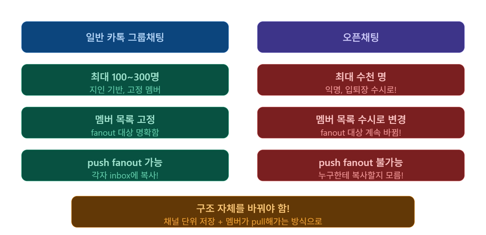
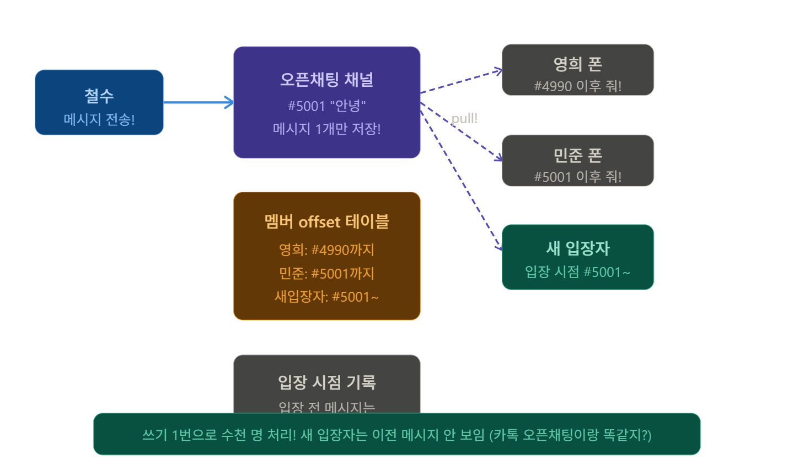
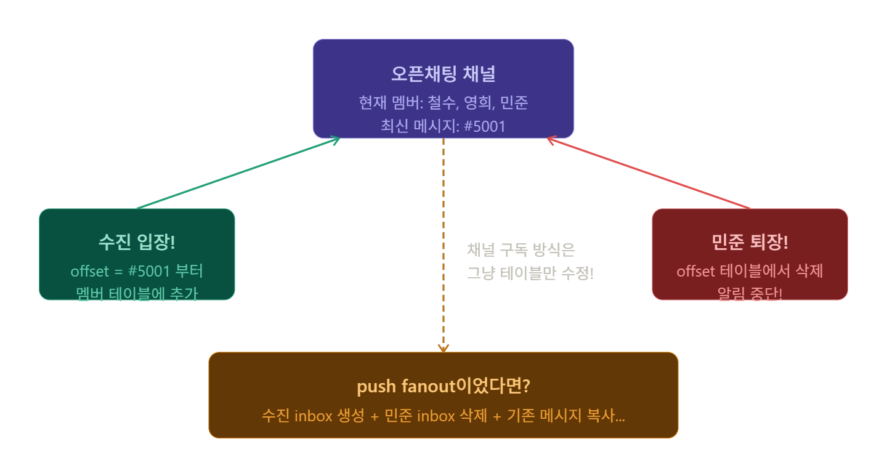
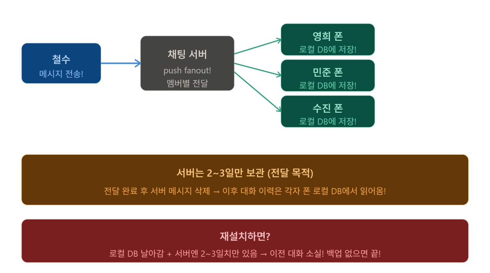
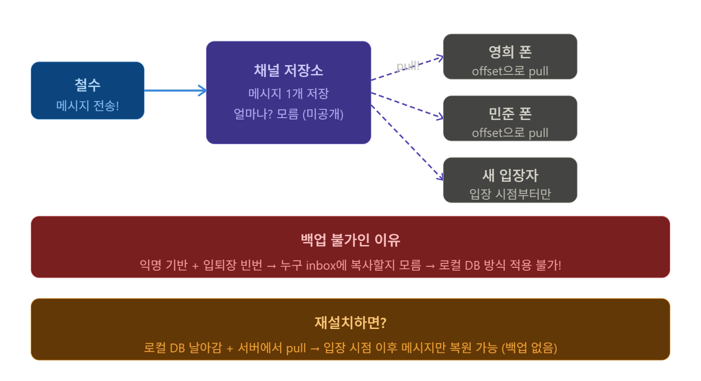

## **`cur_max_message_id` 방식의 약점은 뭘까?**

네트워크가 끊겼다 재연결되는 순간 pull을 한번 해야 하는데, 이 사이에 메시지가 수천 개 쌓였다면 한번에 가져오는 양이 폭발할 수 있다. 페이지네이션을 어떻게 설계할지, 그리고 "마지막으로 읽은 메시지" 표시(read receipt)와 어떻게 연동할지 생각해보자.

- cur_max_message_id?

  

    - 내 폰이 마지막으로 본 메시지 ID 를 기억해뒀다가,
        - 재연결되는 경우 `그 이후 것만 줘` 하는 방식임
    - 평소엔 되게 효율적인데 문제가 발생할 수 있다.
- 언제 문제가 되냐

  

    - 단톡방에서 30분만 오프라인이어도 수천 개가 쌓임
        - 재 연결 순간에 #100 이후 다 줘 하면 서버 - 폰도 네트워크도 동시에 터짐
- 그래서?
    - 페이지네이션 + read receipt 사용

      

        - 카톡들어가면 항상 최신 대화 내역이 뜨는데, 최신 50개만 일단 보내주고 스크롤 업하면서 페이지네이션으로 50개씩 cursor 요청함.
        - 화면에 실제로 보인 마지막 메시지 ID 를 서버에 `여기까지 읽음` 이라고 찍어주는 기능이
            - read receipt 인거임

**2. 그룹 채팅 xxx명 제한이 fanout 비용과 어떻게 연결되나?**

- 카카오톡의 경우 - 수신자별로 큐를 복사한다 (push fanout)

  

    - 카톡은 메시지를 멤버 수만큼 복사해서 각자 inbox 에 넣는다. 폰이 서버에 `내 inbox` 줘 하며 바로 꺼낼 수 있음.
    - 읽기가 엄청 빠른 대신 쓰기가 멤버 수 만큼 발생한다. 그래서 그룹채팅에 사용자 제한이 존재할 수 밖에 없는거임
- 위챗의 경우 - 채널 단위 저장 ( pull 방식 )

  

    - 메시지를 채널에 딱 1개만 저장함.
    - 멤버들이 각자 `나 ~ 어디까지 읽었다` offset 을 기억해뒀다가 직접 가져가는 방식
    - 쓰기가 1번이라서 수천 명짜리 그룹도 가능
- 카톡도 몇천명 가능하잖아?
    - 일반 카톡방과 오픈 채팅의 구조가 다름

      

        - 일반 카톡의 경우 멤버가 고정이라 `얘네한테 복사해` 가 명확한 편임.
        - 오픈 채팅의 경우 수시로 들어오고 나가서 누구를 inbox 에 복사할지 자체가 불명확함
            - 그래서 구조를 완전히 변경해야 한다고 한다.
    - 오픈 채팅의 경우

      

        - 쓰기 1번으로, 각자 어디까지 읽었는지 offset 으로 pull 해나가는 구조, 새로 입장한 사람은 입장 시점 이후 메시지만 보이게 됨. -  카톡 오픈채팅 들어가는 경우 이전 대화가 보이지 않음..
    - 입 퇴장 처리의 경우 fanout 의 대상이 실시간으로 변경됨

      

        - push fanout 의 경우 수진이가 들어올때마다, inbox 만들고, 기존 메시지를 복사하는 등의 행위가 있을 거임
        - 채널 구독 방식은 offset 테이블에 한 줄 추가/삭제가 끝.
        - 수천명이 들어왔다가 나갔다고 해도 채널 메시지는 그대로이고, 테이블만 변경

### 그런데 왜 일반 단톡방이나, 오픈 채팅이나 나갔다가 들어오면 채팅 내역이 존재하지 않는 것인가?

- 일반 카톡방의 경우

  

    - 일반 카톡방의 경우 push fanout 으로 각자 폰에 전달, 서버는 2~ 3일 후에 지움 ( 2014년 카톡 검열관련된 논란으로 5 ~ 6 일에서 2 ~ 3 일로 변경되었다고 함 )
    - 앱에서 옛날 대화를 볼 수 있는 건 내 폰 로컬 DB 에서 읽는 구조임
        - 카카오톡 백업 기능이 있는건 이건 예외적으로 임시 데이터로 14일간 내가 수동으로 백업하는 거임
- 오픈 채팅방의 경우

  

    - 오픈 채팅의 경우 익명 + 수시 입퇴장이라 push fanout 불가능
    - 채널에 1개 저장하고 각자 pull 이라 다시 입장해도 아무것도 없음 ( 익명 기반 )
        - 다만, 채팅방 존재자체는 살아 있긴한듯함.
    - 중앙 서버에서는 분명히 채팅 내역이 살아 있을거임
        - 예전에 오픈 채팅방에서 사기나 성적인 목적의 접근 등의 문제가 생긴 적이 있음 → 아마 내부적으로만 보관하고 있는 듯함
