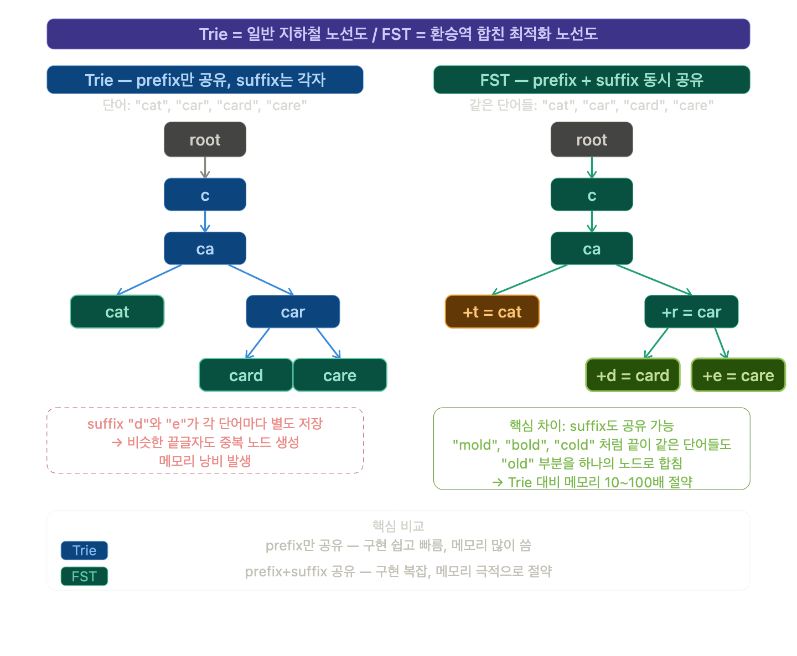
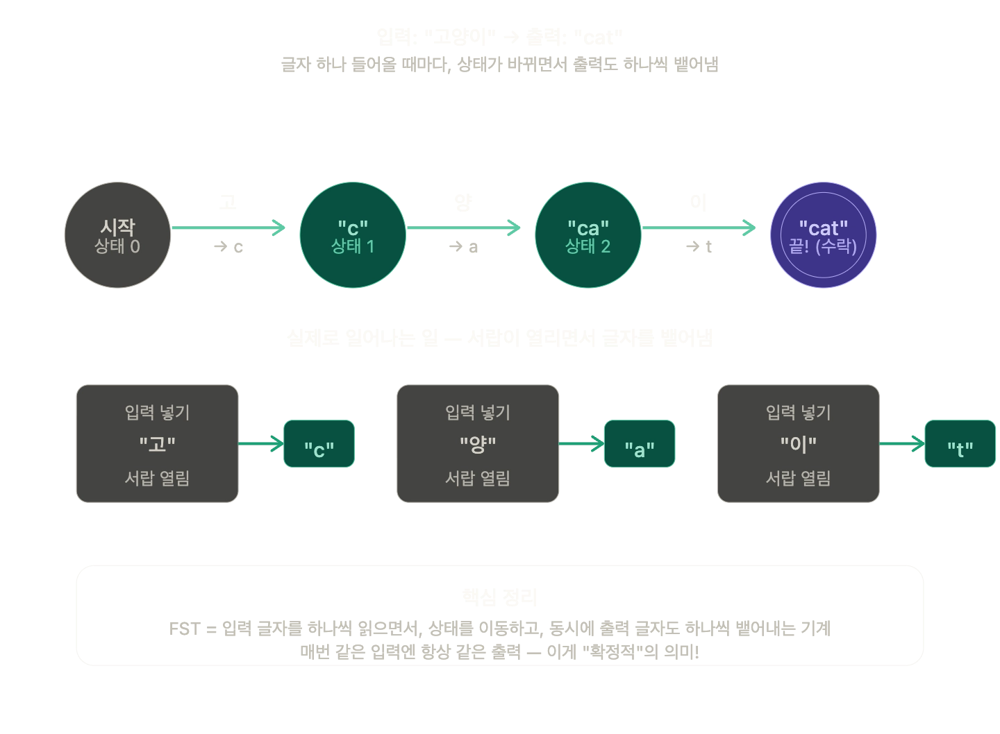

## 구글이 사용하는 자료구조?

- Trie 는 교과서적인 구현이라고 함.
- 실제 구글은 Trie 대신 FST ( Finite State Transducer ) 라는 자료구조를 사용함.
    - Trie 는 공통 prefix 를 공유하지만 FST 는 suffix 까지 공유함 → 메모리를 아끼는 구조임.
- 검색 LIB → Lucene 이 FST 사용중.

### Trie 와 FST 구조적 차이 설명



### 이해가 잘 안되는데.. lucene 내에서 FST 는 어떤식으로 구현되어 있는지 확인해보기

## FST

### 정의

Finite State Transducer ( 유한 상태 변환기 ) 라고하는데
입력 문자열을 읽으면서 출력값을 생성하는 확정적 오토마톤

- 확정적
    - 같은 입력을 넣으면 항상 같은 경로, 같은 출력이 나옴
- 오토마톤 ( Automaton )
    - 오토마톤 `상태를 가진 기계`

---

쉽게 설명하면



- 글자가 하나 들어올 때마다, 상태가 바뀌면서 출력도 하나씩 뱉음.
    - 매번 같은 입력에는 항상 같은 출력을 보장함 ㅇㅇ

### FST 가 어떤식으로 분기되는지?

[fst_tree_structure.html](https://claude.ai/public/artifacts/d69fdced-8975-41e1-b1aa-ab622fa6df62)

---

## Trie 가 방대해지면 → 샤딩을 한다.

- 트라이가 저장된 검색어가 너무 많아지면 → 여러 서버에 나눠서 담아야한다.
    - 샤딩(Sharding) 이라고 함.
- 방법에는 여러 방법이 있다
    1. 알파벳 순서대로 그루핑
    2. 쿼리 패턴 기반 샤딩
- 그래서 샤드 맵 관리자가 어떻게 적절하게 서버로 매핑시키는건지 궁금해짐

[Shard Map Manager: How Database Sharding Works](https://claude.ai/public/artifacts/9476cf63-9b75-4679-a5fc-12d5fac27887)

- 샤드맵은 언제 만들어지는지?

  오프라인 배치 작업 ( 사용자 없는 서버에서 주기적으로 실행 )을 통해 미리 한 번만 계산함.

    ```html
    [주간 배치 Job]
    과거 7일치 로그 분석 → 샤드 경계 재계산 → 샤드 맵 테이블 업데이트
    ```

    ```html
    "star" 입력
      → 첫 글자 'S' 추출           (O(1))
      → shardMap.get('S')          (O(1) 메모리 조회)
      → 10.0.1.x 서버로 전달
    ```

    - 단순 해시맵으로 구성되어 있음
    - 그냥 딕셔너리에서 꺼내는 수준임
- 언제 갱신할까
    - 솔직히 자주 갱신할 이유가 없을듯.. 뭐 일주일단위로 ㄱㅊ고,, 한달도 ㄱㅊ고..
