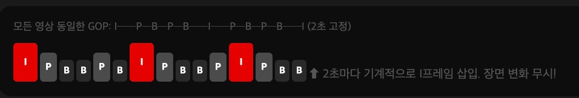
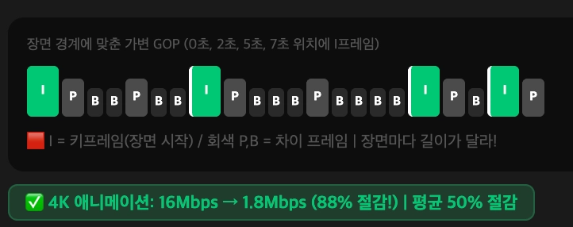

## GOP (Group of Picture) 의 크기를 어떻게 결정하는지..

- 회사마다 다 다른듯..

Netflix 의 경우 장면 기반 가변 GOP 를 사용한다고 한다.

## NetFlix - GOP 최적화 진화 역사

넷플릭스는 어떻게 4K 를 88% 까지 줄였는지..

## 2010 ~ 2015

- 고정 비트레이트 사다리 ( Fixed Bitrate Ladder )
  - 모든 영상에 동일한 인코딩 레시피를 적용함.
  - 해상도-  비트레이트 쌍이 고정임..
    - 항상 360p → 235kbps, 480p → 375kbps, 1080p → 5800kbps …
  - 문제점이 존재했는데
    - 애니메이션의 경우 2000kbps 면 충분하지만… 5800kbps 를 낭비하는 셈임.
  - 반대로 격렬한 액션신의 경우 5800 으로도 부족하고 블록 현상이 발생함.



---

### I 프레임의 위치가 왜 용량이랑 상관있는건지

- P/B 프레임이 뭘 저장하나


    | 프레임 | 저장하는 것 | 용량 |
    | --- | --- | --- |
    | **I프레임** | 완전한 사진 한 장 (독립적) | 크다 (~100KB) |
    | **P프레임** | **앞 프레임이랑 다른 부분만** | 작다 (~10KB) |
    | **B프레임** | **앞뒤 프레임 양쪽과 다른 부분만** | 더 작다 (~5KB) |
- 원래는 장면 전환시마다 문제가 발생함
  - 고정 GOP ( 2초마다 I 프레임 )

      ```html
      대화씬──────────── | 폭발씬──────────────
      I  P  B  B  P  B  |  P  B  B  I  P  B
                        ↑
                  장면 전환인데 P프레임!
      ```

    - 장면 전환 직후 P 프레임은 →
      - 이전 프레임(대화씬) 참조해서 `얼마나 달라졌는지` 계산함.
      - 대화씬 ~ 폭발씬은 화면이 완전히 다름.
        - `차이` 가 엄청 켜져서 → P 프레임도 I 프레임만큼 용량을 써버린다.
  - 장면 경계에 I 프레임이 있는 경우

      ```html
      대화씬──────────── | 폭발씬──────────────
      I  P  B  B  P  B  | I  P  B  B  P  B
                          ↑
                  장면 전환 즉시 I프레임!
      ```

    - 폭발씬의 P 프레임은 같은 폭발씬의 이전 프레임만 참고함
    - 같은 장면 안이라 차이가 훨씬 작음 → P/B 프레임이 작아지는거임

---

## 2015 년 12월

- 영상별 맞춤 인코딩 ( Per - title Encoding )
  - 영상마다 수백 가지 해상도 x 비트레이트 조합으로 테스트 인코딩
  - 블록 껍질을 찾아서 최적 비트레이트 를 결정함
- 영상이
  - 애니메이션인 경우
    - 낮은 비트레이트
  - 액션이면
    - 더 높은 비트레이트

## 2016 년 12월

- 청크별 최적화 ( Per-chunk Encoding )
  - 영상을 ~ 4초 청크로 분할 후 각 청크별로 최적화함
  - 같은 영화라도 조용한 대화씬 - 폭발씬이 다르듯이
    - 청크마다 다른 비트레이트 적용

## 2018 년 3월

- 장면 기반 인코딩 ( Shot-based Encoding )
  - 임의의 2 ~ 3초 청크 대신 → 실제 장면에 맞춰서 GOP 를 배치함.
  - 인접 프레임 간 픽셀의 차이량을 계산하고
    - 차이가 임계값을 초과하면 → 새 장면 시작으로 인식하고 → 그 위치에  I 프레임을 추가( 키프레임임 )
  - 결국 키프레임의 위치가 `불규칙`



# NetFlix CDN 캐싱 전략

- 문제..
  - 넷플릭스 서버가 미국에만 있으면
    - 서울 ↔ 미국 거리 11,000km → 데이터 왕복 시간 최소 100ms ++ 임..
  - 전 세계 2억 8천만명이 동시에 요청하는 순간 >> 서버 터짐
  - 넷플릭스가 선택한 해결책 → Open Connet
- 영상을 미리
  - 한국 ISP ( KT , SKT , LGU + ) 서버에 미리 복사해둠..
  - 넷플릭스 트래픽의 95% 가 ISP 내부에서 해결됨.
  - KT 쓰면 KT 서버에서,, SKT 면 SKT 서버에서,,
- 새벽에 영상을 ISP 에 채워둠.
  - 낮이나 저녁엔 영상을 보기에 그 해당 국가 새벽시간에 ISP 에 몰래 채워둠
- 인기에 따라서도 저장위치가 달라짐
  - ISP 서버는 용량이 유한하기에, 모든 영상을 넣을 수 없음!
    - 인기도에 따라 어디에 둘지를 결정한다.
  - 오징어 게임 같은 대작은
    - ISP 서버에 여러 복제본을 두고
  - 그냥 레이디두아 같은 조금 인기있는 건
    - ISP 서버에 딱 1개만
  - 인기 없는 .. 영상은
    - ISP 서버에 두는게 아니라, 좀 더 먼 IXP 서버에서 가져온다

      > IXP 서버?
      >
      >
      > internet exchange  point → 인터넷 교환 포인트
      >
      > - 여러 통신사들이 한 건물에 모여 서로 연결하는 곳임 ( 상암에 있음 )
      > - KT 카카오 넷플 OCA 서버가 다 같은 건물에 위치
      > - 넷플의 OCA 에서 데이터를 가져오는데 각 통신사는 같은 건물에 있는 넷플 OCA 에서 영상 데이터를 가져오는거임 ㅇㅇ
  - 진짜 개노잼 영상은
    - 미국에서 직접 서빙하는데
      - 영상의 5% 정도라고함.

---

## 출처

- 넷플릭스 오프피크 FILL 전략
  - http://netflixtechblog.com/netflix-and-fill-c43a32b490c0
- **"Netflix content distribution through Open Connect"** (2018) — OCA 구조, 95% 로컬 서빙 수치, IX/ISP 배포 방식
  - http://blog.apnic.net/2018/06/20/netflix-content-distribution-through-open-connect
