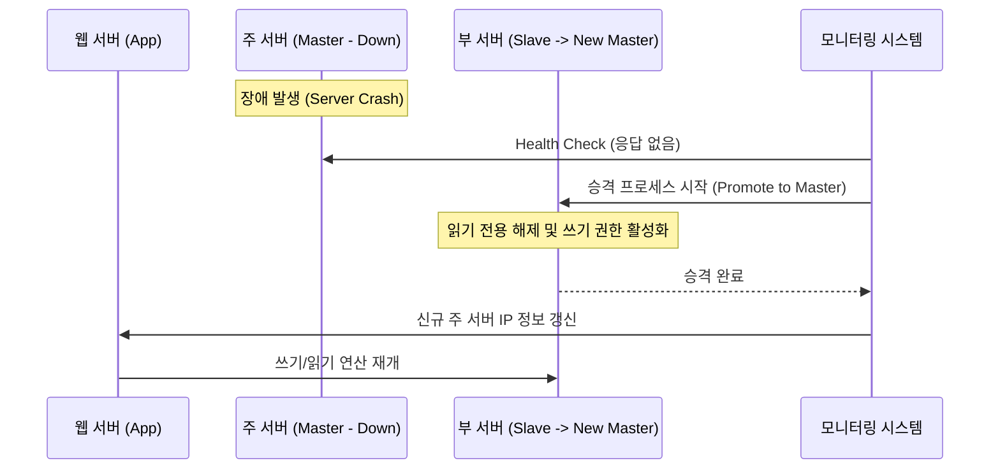
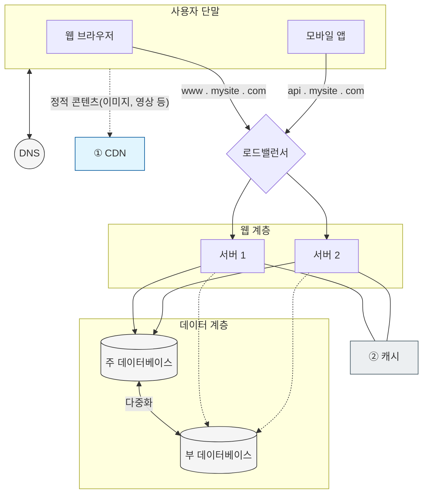
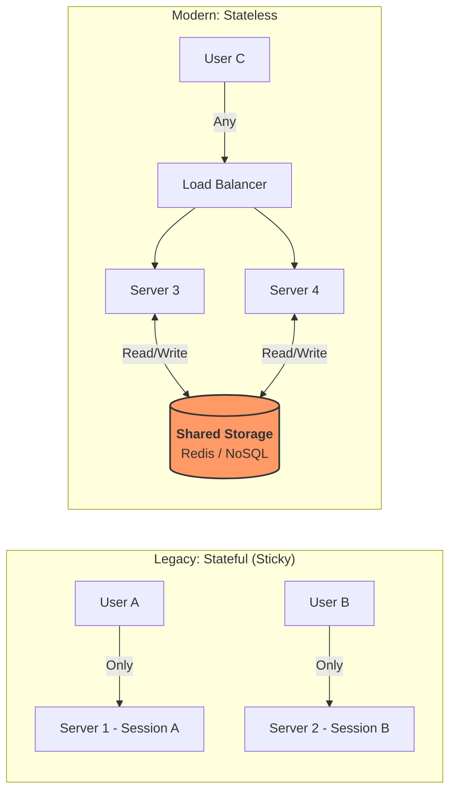
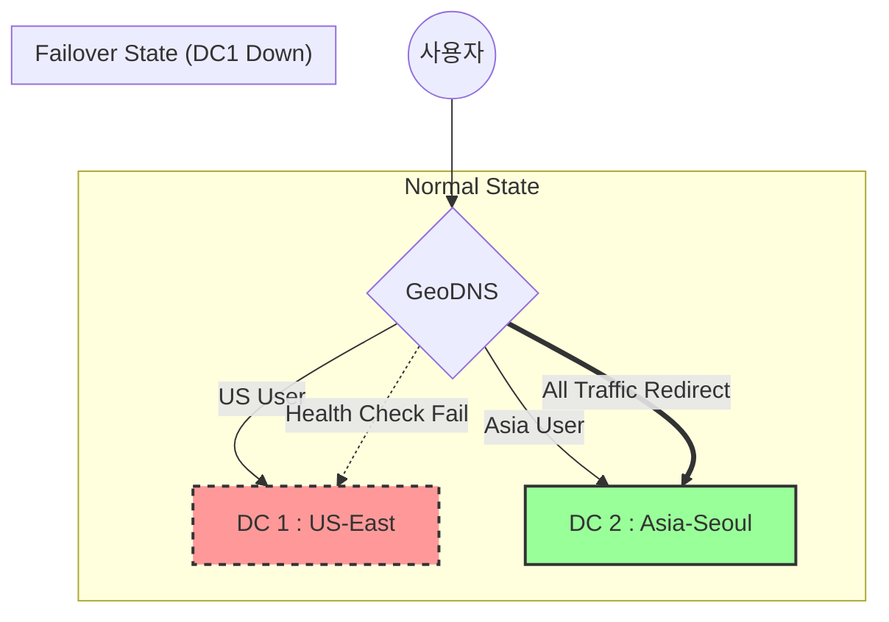

# 단일 서버

- 처음 시스템은 단일 서버에서 시작된다.
    - 웹이든 앱이든 DB + 캐시 등이 한 서버내에서 동작하는데
    - 근데 이렇게 한 서버에 다 때려넣지는 않을 것 같다 아무리 작다고 하더라도
    - 처음에는 뭐 로컬서버에서 개발하니까 비슷한 의미이지 않을 까 싶다.

# 사용자의 요청 처리 흐름

1. DNS 질의
    - 사용자가 도메인 이름 ( [api.mysite.com](http://api.mysite.com) ) 으로 접속시, DNS 에 IP 주소를 물어본다.
2. IP 주소 반환
    - DNS는 서버의 IP 주소 (123.123.23.1234) 를 사용자 단말에 알려준다
3. HTTP 요청
    - 전달받은 IP 주소를 통해 실제 웹 서버에 접속 시도(HTTP 요청)
4. 응답
    1. 요청 결과에 따라 html 혹은 json 데이터 하차

# 계층 분리와 DB 전략

- 확장 가능한 아키텍처를 위해 단일 서버 → 서버 || DB 를 물적으로 분리하는 2번째 단계로 진입
- 왜 서버를 분리해야하는가?
    1. 리소스의 최적화
        1. 웹 서버는 CPU 와 메모리 같은 연산 작업이 대다수.
        2. DB 서버의 경우 디스크 IO 와 메모리 캐싱 성능이 중요
        3. 서버를 분리하면 각각 특성에 맞는 고성능 하드웨어를 개별적으로 할당가능해진다.
    2. 유지보수와 가용성 문제
        1. 웹 서버의 수평적 확장 ( Scale-out ) 하는 경우, 데이터가 한 곳인 DB 서버 에 모여 있어야 데이터 정합성을 유지하기 훨씬 수월하다.

### RDBMS vs NoSQL 기술적인 트레이드 오프

- 무엇이 더 좋은 가? 는 없음 → 지금 내 프로제긑의 비즈니스 모델과 데이터 구조에 무엇이 적합한가? 가 본질이다.
- 뭐 다 알겠지만.
    - RDBMS 의 경우
        - ACID 트랜잭션을 보장한다
        - 보통 데이터의 일관성이 생명인 정보나 데이터간의 연관관계가 필수적인 경우 사용한다
        - 데이터 중복을 막기 위하여 정규화 라는 개념이 존재함..
    - NoSQL 의 경우
        - 정말 유연하다.
        - `수평적인 확장` 에 용이하다.
        - 키에도 여러 종류가 있는데
            1. Key-Value 는 레디스나 멤캐시 등에서 사용하고 : 빠른 캐싱을 위해 사용한다
            2. Document 는 복잡합 비정형 객체 저장 : MongoDB
            3. Column-family : 대용량 로그 분석에 사용된다 ( Cassandra, HBase )
                1. 보통 대용량 로그같은 경우 ES 를 주로 사용한다. ES 는 보통 Document NoSQL 로 분리되긴한다..
                2. 카산드라와 HBase 를 사용해본적은 없어서 잘 모르겠다.
            4. Graph : 복잡한 관계망 서비스에 사용된다 ( Neo4j )
- 대부분의 서비스는 RDBMS 로 시작하는게 일반적이다.
  하지만,
    1. Low Latency 가 필요한 경우 : 밀리초 단위의 응답속도가 필요한 서비스의 경우
    2. 데이터 스키마가 수시로 변경되는 서비스의 경우
    3. 데이터의 폭발적인 증가 : 단일 DB 서버 스토리지 용량을 넘어서는 PB 급 데이터를 다루는 경우.. 여러 서버에 데이터를 샤딩하는 경우
    4. 읽기/쓰기 처리량 극대화할 때 : 조인보다는 단순 조회나 대량 쓰기 작업만이 이루어지는 경우

  에는 NoSQL 이 필요한 상황이다.

    - 보통은 초기단계에서는 필요없고 이미 서비스의 실시간 수집이 방대한 경우에 추가되는 것 같다.

> 현대에서는 https://www.youtube.com/watch?v=N2Ky3neMHa4 으로 보아
>
>
> NoSQL 자체에 대한 언급은 없지만 timescale DB 를 활용 + NoSQL 의 철학을 데이터 스트림에 녹여내
>
> - DB 샤딩 + 프로토버퍼 를 활용하는 듯하다.
> - 보통 실시간으로 계속 쓰여야하는 데이터인 주행거리 등에 대한 데이터를 실시간 수집하고 언제 어떻게 쌓였나 등을 기록하는 등…
> - 프로토 버퍼는
    >     - JSON 보다 효율적인 방식의 직렬화 방식을 사용해 데이터의 크기를 줄이고 처리 속도를 높인 통신 규약이라고 하는데 보통 NoSQL 기반의 아키텍처에서 사용되는 방식이라고 한다.
> - 쌓는 건 쌓는 건데 또 데이터를 거기에서 실시간으로 검색 및 분석하는 경우에는 ES 를 사용한다고 한다.

# 수직적(Scale-up) vs 수평적(Scale-out)

- 시스템 확장시에

| **구분**     | **수직적 규모 확장 (Scale-up)** | **수평적 규모 확장 (Scale-out)**   |
|------------|--------------------------|-----------------------------|
| **정의**     | 고사양 자원(CPU, RAM 추가) 증설   | 더 많은 서버를 추가하여 분산 처리         |
| **장점**     | 구성이 단순하고 관리가 쉬움          | 무한한 확장성, 장애 대응(Failover) 유리 |
| **단점**     | 하드웨어적 한계 존재, 장애 시 전체 중단  | 구성이 복잡하며 로드밸런서 등 추가 장치 필요   |
| **적합한 상황** | 트래픽이 적고 초기 단계일 때         | 대규모 서비스, 고가용성이 필요한 서비스      |

### 로드 밸런서

- 수평적 확장하는 경우, 보통 여러 대의 서버로 트래픽을 고르게 나눠주는 `교통 정리` 역할이 필요하다
- 로드 밸런서의 동작 원리

    ```mermaid
    graph TD
        %% 사용자 및 외부 네트워크
        User((사용자/클라이언트))
        PublicIP[<b>공개 IP: 211.xxx.xxx.xxx</b><br/>로드밸런서 접속 지점]
    
        subgraph "로드밸런서 (Load Balancer)"
            LB_Logic{트래픽 분산 로직}
            HC[상태 확인<br/>Health Check]
        end
    
        subgraph "내부 네트워크 (Private Network)"
            Server1[웹 서버 1<br/>10.0.0.1]
            Server2[웹 서버 2<br/>10.0.0.2]
            Server3[웹 서버 3<br/>10.0.0.3]
        end
    
        %% 연결 관계
        User -- "1. 서비스 접속" --> PublicIP
        PublicIP --> LB_Logic
        
        LB_Logic -- "2. 요청 전달 (사설 IP)" --> Server1
        LB_Logic -- "2. 요청 전달 (사설 IP)" --> Server2
        
        %% 상태 확인 관계
        HC -. "3. 정상 여부 확인" .-> Server1
        HC -. "3. 정상 여부 확인" .-> Server2
        HC -. "X. 장애 감지 (전달 중단)" .-> Server3
    
        %% 스타일링
        style PublicIP fill:#f9f,stroke:#333,stroke-width:2px
        style Server3 fill:#ff9999,stroke:#cc0000,stroke-dasharray: 5 5
        style HC fill:#e1f5fe,stroke:#01579b
    ```

    1. 공개 IP
        1. 사용자 → 로드밸런서의 공개 IP 로 접속한다.
        2. 웹 서버의 IP 를 직접 알 필요가 없다.
    2. 사설 IP
        1. 로드밸런서가 내부 네트워크 사설 IP 로 연결된 웹 서버들에게 요청을 ㄷ전달
        2. 서버 간 통신의 경우 외부에서 차단
    3. 상태 확인 ( Health Check )
        1. 서버가 다운되는 경우 로드밸런서가 이를 감지
        2. 정상적인 서버로만 트래픽을 보낸다

### 로드 밸런서 도입 이점

- 가용성의 증대
    - 서버 1이 죽어도 서버 2가 살아있다면 서비스가 중단되지 않는다
- 유연한 대응
    - 트래픽이 폭주하면 서버 3, 4 를 추가하기만 하면 로드밸런서가 즉시 부하를 분산한다.

# 데이터 베이스 다중화

- DB도 한 대의 한계를 벗어나야한다.
- 가장 보편적인 방식은 Master - Slave 구조라고 한다.

### 다중화 구조 , 역할

1. 주 서버 ( Master / Primary )
    1. 쓰기 연산만 담당함.
    2. 데이터 원본이 될 것임
2. 부 서버 ( Slave / Secondary )
    1. 주 서버로부터 데이터를 복제받는다
    2. 읽기만 수행된다.

- 왜 읽기만 나누나??
    - 보통 일반적인 서비스는 읽기 서비스가 거의 70 % 이상을 수행한다.
    - 부 서버를 여러대 두어서 읽기 성능을 높이는게 서비스 운영상 유리하다.

### 장애 발생시

- 부 서버가 다운 되는 경우
    - 1개만 있는 경우
        - 즉시 주 서버가 읽기 연산을 넘겨받고 새로운 부 서버를 준비
    - 여러 대라면
        - 나머지 부 부서들이 부하를 나누어 가지게 된다..
- 주 서버가 다운 되는 경우
    - 부 서버 중 한대가 `새로운 주 서버` 로 승격처리된다.

  > 다만!
  >
  >
  > 복제 데이터가 최신이 아닐 수 있으므로 실무에서는 `복구 스트립트` 나 `다중 마스터` 등의 복잡한 전략을 추가로 고려해야 한다.

>



> 복구 스크립트?
>
>
> ```mermaid
> flowchart TD
>     A[주 서버 장애 발생 & 페일오버 완료] --> B[구 주 서버의 스토리지/로그 접근]
>     B --> C{로그 분석 단계}
>     
>     subgraph "복구 스크립트 핵심 로직"
>     C --> D[마지막 복제 지점 확인<br/>Last Applied GTID/Offset]
>     D --> E[유실된 트랜잭션 추출<br/>Delta Data Extraction]
>     E --> F[SQL 변환 및 필터링<br/>Idempotent Scripting]
>     end
>     
>     F --> G[신규 주 서버에 데이터 적용<br/>Replay to New Master]
>     G --> H[데이터 정합성 검증]
>     H --> I[복구 완료 및 서비스 정상화]
> 
>     style C fill:#f9f,stroke:#333
>     style F fill:#bbf,stroke:#333
>     style G fill:#dfd,stroke:#333
> ```
>
> - 주 서버가 예기치 않게 종료된 경우, 미처 복제되지 못한 데이터를 새 주 서버에 반영하는 과정이 필요하다.
> - 과정
    >     1. 로그를 분석
    >         1. 장애가난 서버는 서비스 자체는 불가능해도. 데이터가 담긴 스토리지는 살아있는 경우가 많다
    > 2. 주 서버의 디스크에서 `Binary Log` 를 추출한다.
    >
2. 유실 지점을 계산해야 한다
   >         1. 언제 어디서 데이터가 diff 가 있는 지 확인해야하는데
   >
2. 신규 마스터 ( 구 슬레이브 ) 가 마지막으로 처리한 GTID ( Global Transaction ID ) 혹은 로그 파일의 오프셋(Offset) 위치를 확인한다.
   >             1. 해당 지점 이후의 로그만 추려내게 된다.
>     3. 스크립트 변환처리 및 필터링 ( Transform )
         >         1. 단순 로그를 밀어 넣는 게 아니라, 멱등성을 확보해야 한다
         >
2. 만약 일부 데이터가 이미 들어가있는 경우 `Duplicate Key` 오류가 발생할 수 있기에 스크립트가 에러로 멈출수있다.
>         3. `INSERT` 문을 `REPLACE INTO` 혹은 `INSERT IGNORE` 로 변경하거나, 중복을 체크하는 로직을 스크립트에 포함해야한다.
>     4. 데이터 적용 + 검증
         >         1. 변환된 SQL 을 신규 마스터에서 실행한다
         >
2. 이후 검증은 필수다
   >             1. 주요 테이블의 COUNT 나 핵심 데이터 `Checksum` 비교로 양쪽의 DB 상태가 동일한지 최종 확인한다.
   >
   >             > 체크섬을 비교하는 행위가 무엇인가?
   >             >
   >             > - 데이터의 지문을 비교하는 행위이다..
   >             > - 개수를 넘어서 데이터의 내용에 대해 1비트라도 다른지 확인하는 과정으로서
   >             > - 유실된 데이터가 1도 없는 지 확인할 수 있는 과정이다.

# 캐시

- DB는 기본적으로 고비용 자원이다. DB 에 접근하는 행위 자체가 부하가 많이 가는 행위고 거의 대부분의 병목이 발생하는 부분이다. 외부 API 쪽 다음의 병목지점이라고 볼 수 있다..
- DB 접근을 최소화하려면 캐시를 통해 시스템의 처리량을 좀더 가져가는 행위가 중규모 이상의 프로젝트에서는 필수라고 볼 수 있다.

### 캐시의 본질 : 속도를 넘어서..

- 지연 시간 감소
    - 메모리 접근 속도는 ns 단위로서 디스크 접근의 ms 단위보다 수십만 배는 빠를 수 있다.
- 스루풋 == 처리량 증대
    - 병목 지점인 DB의 부하를 줄여서 시스템 전체가 처리할 수 있는 요청 수인 RPS 를 증대할 수 있음
- 비용 절감
    - DB 스케일 up 비용보다 캐시 서버의 비용이 훨~ 씬 저렴하다.

### 캐시 전략

1. 읽기 주도형 Read Through

    ```mermaid
    sequenceDiagram
        participant App as 애플리케이션
        participant Cache as 캐시 (Library/Provider)
        participant DB as 데이터베이스
    
        App->>Cache: 1. 데이터 요청
        Cache->>Cache: 2. 데이터 확인
        alt Cache Miss
            Cache->>DB: 3. DB에서 데이터 로드
            DB-->>Cache: 데이터 반환 및 저장
        end
        Cache-->>App: 최종 데이터 반환
    ```

    - 어플리케이션은 캐시만 바라본다. 데이터가 없는 경우 `캐시 제공자` 가 DB에서 데이터를 로딩한다.

   > 캐시 제공자?
   >
   > - 스프링에서는 `CacheManager` 가 되겠다.
   > - `@Cacheable` 어노테이션을 사용하는데
       >     - 만약 해당 키값이 캐시 (구현체가 레디스인 경우) 에 존재하지 않으면 자동으로 DB 조회를 하는
       >
       >     ```java
       >     @Cacheable(value = "userCache", key = "#userId")
       >     public User getUserById(String userId) {
       >         // 이 메서드 내부가 DB 로직입니다.
       >         return userRepository.findById(userId);
       >     }
       >     ```
       >
       >     - 와 비슷하다고 볼 수 있다
2. Look Aside

    ```mermaid
    sequenceDiagram
        participant App as 애플리케이션
        participant Cache as 캐시 (Redis 등)
        participant DB as 데이터베이스
    
        App->>Cache: 1. 데이터 확인 (Get)
        alt Cache Hit
            Cache-->>App: 데이터 반환
        else Cache Miss
            App->>DB: 2. DB 데이터 조회
            DB-->>App: 데이터 반환
            App->>Cache: 3. 데이터 쓰기 (Set)
        end
    ```

    1. 어플리케이션이 캐시를 먼저 확인하고, 없다면 DB에서 가져와서 캐시에 심는 방식
        1. 장점
            1. 캐시 장애가 발생해도 DB로 서비스가 유지됨.
            2. 실제로 요청된 데이터만 캐싱되기에 메모리 효율성이 좋다
        2. 단점
            1. Cache miss 발생 시 3번의 네트워크 호출이 발생하는 문제가 있다
                - 이를 Thundering Herd 라고 한다.

       > Look Aside 와 Read Though 차이점이 뭘까?
       >
       > - 그냥 데이터 로딩의 주체의 차이이다.
       > - 애플리케이션 코드가 DB에 직접 간다면 Look Aside
       > - 애플리케이션 코드는 캐시 혹은 래퍼 라이브러리에게만 요청하는 케이스는 Read-Through 이다. ( 스프링에서 캐셔블 )
3. Write - Through

    ```mermaid
    sequenceDiagram
        participant App as 애플리케이션
        participant Cache as 캐시
        participant DB as 데이터베이스
    
        App->>Cache: 1. 데이터 쓰기 요청
        Cache->>DB: 2. DB에 데이터 저장 (동기)
        DB-->>Cache: 완료 알림
        Cache-->>App: 3. 쓰기 완료 반환
    ```

    - 데이터를 쓰는 경우 캐시와 DB 에 동시에 쓰기 수행
4. Write - Back

    ```mermaid
        sequenceDiagram
        participant App as 애플리케이션
        participant Cache as 캐시
        participant DB as 데이터베이스
    
        App->>Cache: 1. 데이터 쓰기 요청
        Cache-->>App: 2. 즉시 완료 반환 (Success)
        Note over Cache, DB: 일정 시간 뒤 또는 일정량 쌓인 후
        Cache->>DB: 3. 배치(Batch) 업데이트 (비동기)
    ```

    - 캐시에 먼저 쓰고 비동기적으로 DB에 배치날림.
    - 쓰기 성능이 극대화된다는 장점이 있지만, 캐시 서버가 죽으면 데이터가 유실되는 문제가 있어서.. 비추

### 캐시 사용시 문제점

1. 데이터의 불일치
    1. 문제 상황
        1. DB 는 업데이트되었는데, 캐시가 옛날 값을 가지고 있는 경우
    2. 해결
        1. TTL 설정
            1. 일관성 자체가 완벽할 필요가 없다면, 적절한 TTL 설정으로 해결
        2. 능동적 갱신
            1. DB 업데이트하는 경우 cache evict 수행
2. Cache Penetration
    - 문제
        - DB에도 없고 캐시에서 없는 키를 계속 악의적으로 호출하면, 모든 요청이 Cache 쪽으로 가지 않고
        - DB로 쏟아지게 된다.
    - 해결
        - Null Object Caching
            - DB 에 값이 없고, null 이라도, 30초 정도의 짧은 시간으로 캐싱을 하도록 처리함.
        - Bloom Filter
            - 요청이 들어오기 전에 해당 키가 존재하는지 확률적으로 먼저 검사해 거른다.
                - 캐시에 없는 값은 무조건 없다고 대답하는 천재적인 필터임

      > Bloom Filter?
      >
      > - 레디스에도 해당 기능이 존재한다
      > - 기본적으로 어떤 데이터에 대해 있는지 없는지를 `아주 빠르게 확인` 할 수 있는 거름망이다
      > - Redis 나 DB 같은 경우 해당 데이터가 있는지 빠르게 확인하기 위해 bit 단위로 체크하여 빠른 시간내에서 체크가능함
          >     - 예를 들어 컨퍼런스에 입장하는 사람이 너무 많아서 있는지만 간단하게 확인하기 위하여
          >         - 명단에 사람이 추가되는 경우
          >             - ‘박상준’ 이 오는 경우 ‘박’ 씨 + 생일 ‘11월’ 칸에 체크
          >         - 새로운 사람이 오는 경우
          >             - `이영희` 가 온 경우 ‘이’ 씨 + 생일 3월 칸에 하나도 체크 안되어 있다면, 명단을 볼 필요도 없이 명단에 없음.
          >         - 있다고 구라칠수있지만 **`없는 건 확실하게 없다고 보장`**
3. Cache Avalanche ( 캐시 눈사태 )
    - 문제
        - 수많은 키가 동시에 TTL 만료, 캐시 서버 전체 다운시 모든 요청이 DB로 폭주하는 현상
    - 해결
        - TTL 에 Jitter (임의 값을 추가) : 1시간 뒤에 전부 만료 X 55 ~ 65분 사이로 퍼지게 설정해야함
        - Redis Cluster/Sentinel 구성해야함
            - 클러스터는 Master - Slave 이고
            - Sentinel 은
                - 클러스터 Master 가 죽은 경우 어떤 Slave 를 Master 로 승격시킬건지 투표하는 하나의 아키텍처임
4. Thundering Herd ( 핫 키 만료)
    - 문제
        - 엄청나게 인기 많은 특정 키가 만료되는 순간, 수천 개의 요청이 동시에 `캐시에 존재하네 -> DB 에서 가져와야지` 하는 DB 를 구타하는 현상
    - 해결
        - Mutex Lock
            - 한 번에 하나의 요청만 DB에 접근해서 캐시를 갱신하도록 락을 검
        - Soft TTL
            - 실제 만료 시간전에 갱신 로직을 비동기로 수행하게함.

### 캐시 메모리 관리 및 제거 정책 ( Eviction Policy )

- LRU → 가장 오랫동안 참조되지 않은 데이터 버리기
    - 일반적으로는 해당 전략 사용함.
- LFU → 사용 빈도가 가장 낮은 데이터 버리기
- FIFO → 먼저 들어온 놈 먼저 버리기

# CDN ( 콘텐츠 전송 네트워크 )

### 역할

- 전 세계에 퍼져있는 `엣지 서버` 들이 사용자와 가장 가까운 거리에서 정적 콘텐츠 ( 이미지, CSS, JS 등) 를 대신 전달해주는 기술이다.
    - 서버와 실제 사용자의 물리적 거리가 줄어들면 RTT (패킷 왕복 시간, Round Trip Time) 가 줄어듬. (LA 유저가 서울 서버까지 올 필요 없이 샌프란시스코 CDN 에서 받음)
    - Origin Offloading
        - 정적 파일 요청 자체가 웹 서버까지 도달하지 않음.
        - 웹 서버는 `비즈니스 로직에만 집중` 가능

### 동작 원리

- 가장 보편적인 Pull 방식인 On-demand Caching 의 흐름임

    ```mermaid
    sequenceDiagram
        participant User as 사용자 (Client)
        participant CDN as CDN (Edge Server)
        participant Origin as 원본 서버 (Origin)
    
        User->>CDN: 1. image.png 요청 (GET)
        alt CDN에 파일이 없음 (Cache Miss)
            CDN->>Origin: 2. 원본 파일 요청
            Origin-->>CDN: 3. 파일 반환 (+TTL 헤더)
            CDN->>CDN: 4. 캐싱 (Caching)
            CDN-->>User: 5. 파일 응답
        else CDN에 파일이 있음 (Cache Hit)
            CDN-->>User: 6. 즉시 응답 (원본 접근 X)
        end
    ```

### CDN 도입시 고려 사항들

1. 비용 관련
    1. CDN 은 일반적으로 트래픽의 양에 따라 과금이 된다고 한다
    2. 롱테일의 법칙에 따라 `자주 호출되지 않는 콘텐츠까지 캐싱하는 것은 낭비` 임.

       > 롱테일의 법칙?
       >
       > - 5년전에 올린 개인 블로그의 이미지, 비주류 언어 설명서 파일 등 조회 빈도가 낮은 파일 등을 엄청나게 많이 존재한다
       > - 그 부분은 `꼬리` 부분인데, 그 꼬리 부분이 실제로는 양이 엄청나게 방대함 이를 Long Tail 이라고 칭한다.
2. TTL 설정
    1. 캐시 만료 시간을 어떻게 잡냐가 중요
        1. 길면 → 옛날 화면을 보게될 것이고
        2. 짧으면 → CDN 의 효과가 없어지게 된다.

        - 그냥 적절하게 잘 변하지 않는 건 길게
        - 자주 바뀌는 파일은 짧게 가져가거나 버전을 명시해야한다.
3. 장애 대응
    1. CDN 이 죽는 경우 클라이언트가 이를 감지해서 원본 서버로 직접 요청이 가능하도록 `Fallback` 로직이 있어야함.
    2. Fallback 처리
        1. Multi-CDN 처리
            1. CDN 하나가 죽는 경우 다른 브랜드의 CDN 으로 자동으로 전환되도록 설정
        2. HTML/ App 레벨에서 에러 핸들링
            - 앱에서 이미지 에러 발생시 → 기본 이미지 교체 ..
            - 근데 이건 너무 번거로워서 사용하지 않을것 같다.

    - 실제로 서비스가 1분이라도 멈췄을때의 손실이 Fallback 로직을 만드는 개발비보다 큰지 생각해보면 fallback 이 필요할지 판단이 된다.
4. 무효화 전략
    1. 잘못된 파일이 캐싱되었거나, 급하게 업데이트해야하는 경우 기존 캐시를 어떻게 지울 것인지?
        1. Purge ( API 호출 )
            1. CDN 업체에 `해당 파일을 지워달라고` 직접 요청도 가능하긴함. 근데 상황에 따라 결정해야함
                1. 전파 속도가 항상 빠른게 아님. CDN 퍼지의 경우 길면 하루이상 걸리는 경우도 보았음.
                2. 진짜 긴급하게 파일 URL 을 유지해야하는 경우에는 Purge 가 유일한 답이 될 것임.
        2. Versioning
            1. 파일 뒤에 ? version=1 , version=2 이런식으로 버전을 붙여서 처리하는 경우
            2. 단순히 version 만 변경하는 경우 항상 새로운 파일로 인식되기에 캐싱이 전역적으로 동작하지 않고 새로 서버에서 들고오게됨.
                - 즉, 즉각적인 캐싱 무효화가 가능해진다.

## 정리 → 이때까지의 흐름상 아키텍처 구조도



# 무상태 웹 계층



### 과거 방식 : 상태 정보의 의존하는 Stateful

- 서버가 클라이언트의 Session 등을 직접 들고있는 구조.
- 사용자 A 가 서버 1 에 접근하면
    - 서버 1는 사용자 A 의 세션을 가지고 있음.
- 로드 밸런서는 사용자 A 의 요청이 무조건 서버 1 으로 가도록 제어해야함.
- 단점
    - 서버를 늘리고 줄이는 경우에 로드밸런서 설정을 계속 신경써야함..
    - 서버 1이 죽어버리면 붙어있던 사용자들의 로그인이 다 풀린다.

### 현대 방식 : 무상태  Stateless

- 웹 서버는 로직만 처리하고 데이터는 외부에 맡기는 철학
- 세션 데이터를 웹 서버 메모리에서 뺴서 `공유 저장소` 로 옮긴다.
- 주로 `Redis` 같은 인메모리 DB나 확장이 쉬운 NoSQL 을 사용한다.
- 장점
    - 서버의 부품화
        - 어떤 서버가 요청을 받든 공유 저장소에서 데이터를 꺼내오면 되므로 결과가 같다.
    - 수평 확장에서 더 자유로워진다
        - 단순히 로드밸런서는 트래픽만 나눠주면 되고, 서버는 트래픽이 몰리면 늘리고, 줄면 개수를 줄이면 그만이다.

# 데이터 센터

- 단순히 서버 늘리는게 아니라, DR 같은 재해복구 ( 카카오 사태 같은거 ) 글로벌 지연 시간 해결 방안에 대한 인프라 관련 내용

### GeoDNS ( 지리적 라우팅 )

- 사용자의 접속 위치를 기반으로 `물리적으로 가장 가까운 데이터 센터` IP 를 반환하는 기술임
- `AWS Route 53` 등이 대표적이다.
- 평시
    - US-east Us west 등으로 트래픽을 분산처리한다. ( 리전이 다름 )
- 비상시
    - 헬스 체크 실패하는 경우 살아있는 모든 데센으로 모든 트래픽을 자동 우회 처리한다.

### 데이터 센터 우회 시나리오



### 해결 해야할 기술 난제 3가지

1. 트래픽 우회 처리
    1. 단순히 DNS 만 믿으면 안된다. DNS 자체는 캐싱을 하기에 DC가 죽어도 해당 죽은 DC 로 접속을 계속 시도할 수 있음..
    2. TTL 을 짧게 가져가거나 `AnyCast IP` 같은 기술을 사용해야한다고함.

   > AnyCast IP?
   >
   > - 원래 IP(Unicast) 는 1:1 로 특정 서버 한 대를 찾아가는 주소임..
   > - AnyCast 는 `하나의 IP 주소를 전 세계 여러 서버가 공유` 하는 방식이다.
   > - 119 전화할떄 항상 같은 곳만 가는게 아니라, 전화시 내가 전화한 위치에서 가장 가까운 소방서로 연결되는데, 해당 기능을 AnyCast 가 수행해주는 것이라고 생각하면 된다.
2. 데이터 동기화 문제
    1. 문제 상황
        1. DC1(미국) 에 쓰지마자 DC1 터짐 → DC2(한국) 으로 트래픽이 넘어갔는데
        2. 방금 쓴 데이터가 DC2 에는 존재하지 않음.
    2. 전략
        1. Active - Passive
            - 주 DC에만 쓰고, 부 DC는 복제만 받기 ( 데이터 유실의 문제가 있음 )
        2. Active - Active
            - 양쪽 DC에서 동시에 쓴다.
                - 가용성은 좋지만, 데이터 충돌(Conflict) 해결 로직이 복잡함.
3. 테스트 and 배포 문제
    1. DC 1 에서 2버전 배포 → DC 2 에서는 1.9버전이라면 → 로직 불일치의 발생
    2. 해결
        1. IaC ( Infrastructure as Code , 테라폼/엔서블 ) 도구와 자동화 CI / CD 를 통해 모든 리전의 인프라와 코드를 `불변` 상태로 동일하게 유지해야함.

   > 테라폼?
   >
   > - 클라우드든 온프레미스든, 서버 EC2 , 네트워크 VPC, DB 등을 `코드로 선언` 하여 자동으로 생성한다.
   > - 서버 10대와 네트워크 1개를 만들라고 코드로 적어두면, 어느 리전이든 똑같은 사양으로 인프라를 한 방에 구축함.

# 메시지 큐

- 다중 서버가 된 경우 서버 간의 데이터를 직접 주고받게 되면, 서로간의 강한 결합이 발생한다.
- `일단 받아두고 나중에 처리한다` 의 비동기 매커니즘을 서버간 통신에도 적용해야한다.
- 역할
    1. 느슨한 결합
        1. 생산자 - 소비자 구조의 경우 생산자는 소비자가 죽었는지 살았는지 알 필요가 없음
        2. 단순히 큐에 쌓기만 한다
    2. 부하 평준화
        1. 트래픽이 폭주하더라도 큐가 앞에서 막아줌.
        2. 뒤단의 컨슈머들은 자기 능력껏 들고가면 그만이다.
    3. 신뢰성
        1. 큐에 들어온 메시지는 소비될때까지 안전하게 보관처리됨 ( 디스크 저장 등 )
- 티켓 예매나 선착순 서비스의 경우
    1. 수십만의 요청이 순식간에 들어오면 DB 가 그대로 다 받으면 DB는 죽어버린다
    2. Kafka 같은 대용량 큐에 요청을 다 버퍼링해두고
    3. 뒤에서 결제 서버가 가능한 속도로 큐를 소비하는 식으로 처리

# 로그, 메트릭, 자동화

- 서버가 1 ~ 2 대인 경우 단순히 `tail -f` 로 로그보지만..
- 서버가 수십대가 되면 사용이 불가능하다.

### 로그

- ELK Stack 이나 Datadog 같은 도구로 로그를 중앙 집중화 처리한다.
- 또한 Error 레벨의 로그가 뜨면 슬랙으로 알림을 줄 수도 있다.

### 메트릭

- 역할
    - 시스템 상태가 어떠한지?
- 예를 들어 인프라에서 CPU 사용량이 90% 이상이면 경고
    - 서버에서 API 레이턴시가 500ms 이상이면 경고
    - DB 슬로우쿼리 경고 등..

### 자동화

- CI CD 말하는거임

# 데이터 베이스 규모 확장 : 1단계 ( 수직 확장 )

- 시스템이 안정된 경우 데이터가 쌓이면서 DB 가 느려진다.
- 수직적 확장 == 스케일 업
    - DB 스펙 올리는 거임
- 성능은 좋아지나, 분명히 한계가 있음..
- 성능이 2개 오르면, 비용이 4배오름 ㅋㅋ

# 데이터 베이스 규모 확장 : 2단계 ( 수평 확장 )

- 샤딩을 일반적으로 의미한다.
- 저렴한 서버 10대, 100 대 에 데이터를 쪼개서 저장하는 것이다.
- 중요한 점
    - 서버에서 `어떤 데이터를 어느 서버로 보낼지` 결정해야한다.

## 샤딩의 원리

- 샤딩은 단순히 데이터를 나누는 규칙을 정하는 것이다.
- 무엇을 기준으로 쪼갤지가 가장 중요하다.

## 샤딩 전략

### Hash Sharding ( user_id % 4 )

- 가장 단순하고 고르게 퍼지는 샤딩 전략
- 치명적인 단점
    - 서버를 4 대에서 5대 증설, 기존 데이터 위치가 전부 바뀌어버림.
    - 서버를 증설했는데 데이터 마이그레이션을 해야하는 문제가 발생
    - 내가 볼땐 이건 좀..

### Range Sharding ( 날짜별, ID 범위별 )

- `1~1000번 유저` 의 경우 서버 A 로, `1001 ~ 2000` 의 경우 서버 B 로
- 관리면에서 해시 샤딩보다는 편하다. 다만
    - 최신 유저 의 경우 하나의 서버에 트래픽이 몰리는 문제가 충분히 발생할 수 있다.

## Hot Partition Key 문제 ( 유명인사 문제 )

- 해시 샤딩이던 범위 샤딩이던
    - 만약에 저스틴 비버나 레이디 가가 같은 유명인사가 비슷한 날짜에 가입했던가 해서, 같은 샤드에 저장되었다고 생각해보자
    - 해당 데이터가 있는 경우 수천만 명이 동시에 읽거나 쓰기를 할텐데, 해당 데이터가 있는 샤드를 물리적으로 버틸 수 없다
- 해결방안
    - 트위터나 인스타같은 경우
        - Write Fan Out
            - 일반 유저는 글을 쓰는 경우 팔로워들의 타임라인 테이블에 데이터를 밀어넣기 처리
            - `일반 유저 한정` 팔로워가 적어야 가능한 방식이다.
        - Read Fan Out
            - 유명인들의 경우 팔로워가 너무 많아서 밀어넣기가 불가능함.
            - 유명인의 글은 별도의 고성능 캐시 클러스터에 저장 + 팔로워들이 접속할 떄 가져가도록 Pull 처리한다.

            ```mermaid
            graph TD
                subgraph "Write Fan-Out (일반 사용자: Push)"
                    UserA[일반 사용자 A] -->|글 작성| AppA[App Server]
                    AppA -->|데이터 복사/배달| F1[팔로워 1 타임라인]
                    AppA -->|데이터 복사/배달| F2[팔로워 2 타임라인]
                    AppA -->|데이터 복사/배달| F3[팔로워 3 타임라인]
                end
            
                subgraph "Read Fan-Out (유명인: Pull)"
                    Celeb[유명인/인플루언서] -->|글 작성| CelebCache[고성능 유명인 캐시]
                    FollowerX[팔로워 X] -->|앱 접속 시| Pull{데이터 당겨오기}
                    Pull -->|조회| F_TL[자신의 타임라인]
                    Pull -->|조회| CelebCache
                end
            
                style CelebCache fill:#f96,stroke:#333
                style Pull fill:#e1f5fe,stroke:#01579b
            ```

        - 키 분산 처리
            - 특정 핫 키 뒤에 난수를 추가 ( justin_biebar_1, _2 ) 를 붙여서 여러 샤드에 강제로 분산처리

                ```mermaid
                graph LR
                    UserRequest[수천만 명의 유저 요청] --> LB[로드밸런서]
                    
                    subgraph "Cache Shards (분신술)"
                        S1[캐시 서버 1<br/>celeb_ID_1]
                        S2[캐시 서버 2<br/>celeb_ID_2]
                        S3[캐시 서버 3<br/>celeb_ID_3]
                    end
                
                    LB -->|난수 기반 분산| S1
                    LB -->|난수 기반 분산| S2
                    LB -->|난수 기반 분산| S3
                
                    style S1 fill:#fff3e0,stroke:#ff9800
                    style S2 fill:#fff3e0,stroke:#ff9800
                    style S3 fill:#fff3e0,stroke:#ff9800
                ```

## 조인이 불가능해진다.

- 데이터가 쪼개지는 경우 `JOIN` 연산은 불가능하다.
- 배민 같은 경우
    - 모놀리식 → MSA 전환하면서 DB가 주문 DB, 배달 DB, 회원 DB로 쪼개졌다..
    - 해결방안으로 제시한게
        - `Application-side Join` 과 CQRS 이다.
            1. Application-side Join 은 간단하다.
                1. 그냥 어플리케이션단에서 여러 select 한거 코드레벨에서 합치는거임..
                2. 이건 성능적으로 확실히 문제가 많다.
            2. CQRS 는
                1. 읽기 전용 DB ( ES 등 ) 을 따로 두고 그것에 미리 조인된 형태로 데이터를 펴서 저장해 두는 거임.
                    1. 쉽게 풀자면,
                        1. 쓰기 DB (RDB) 의 경우
                            1. 주문, 가게, 결제 데이터가 엄격하게 정규화되어 각자의 DB에 저장된다.
                            2. 이는 정확성을 위해 당연함
                        2. 읽기 DB ( NoSQL / ES )의 경우
                            1. 사용자가 화면에서 보고 싶어 하는 최종 형태의 JSON 을 통쨰로 저장해 둔다.
                    2. 실제 흐름상으로

                        ```mermaid
                        sequenceDiagram
                            participant User as 사용자
                            participant WriteSvc as 주문 서비스 (Write)
                            participant Kafka as Message Broker (Kafka)
                            participant Sync as 동기화 워커
                            participant ReadDB as 읽기 DB (Elasticsearch)
                        
                            User->>WriteSvc: 1. 주문하기
                            WriteSvc->>WriteSvc: 주문 DB 저장
                            WriteSvc-->>Kafka: 2. 주문 완료 이벤트 발행
                            
                            Note over Sync, ReadDB: 비동기 처리
                            Kafka-->>Sync: 3. 이벤트 수신
                            Sync->>Sync: 가게/회원 정보 조회 및 조립
                            Sync->>ReadDB: 4. 합쳐진 데이터 저장 (Flat Document)
                        
                            User->>ReadDB: 5. 내 주문 목록 조회 (JOIN 없음!)
                            ReadDB-->>User: 즉시 응답
                        ```
