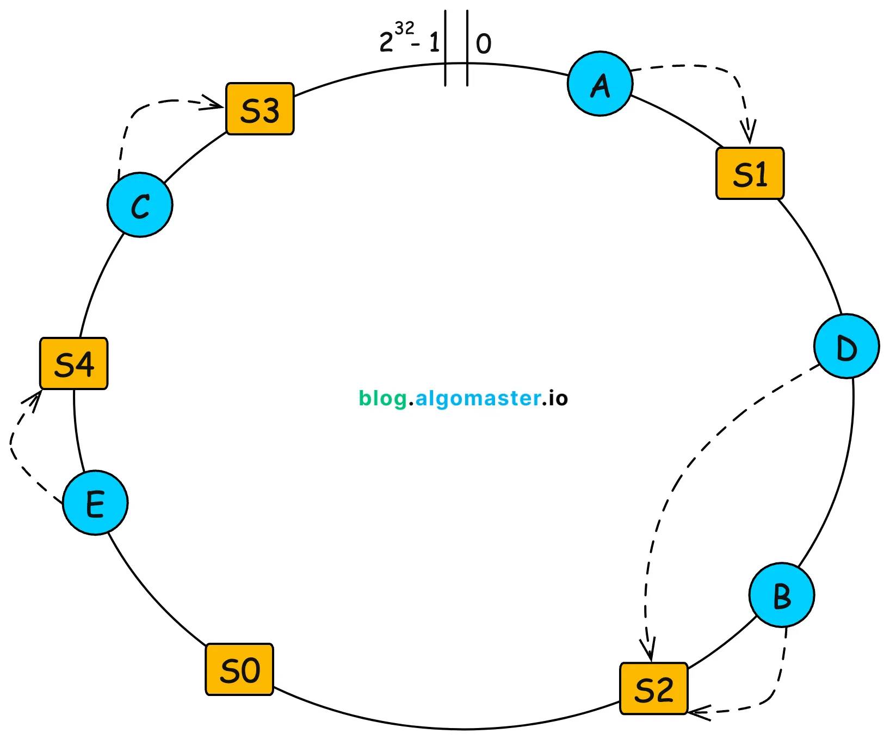

## 넷플릭스 [2017] 안정 해시 적용

[Announcing EVCache](https://netflixtechblog.com/announcing-evcache-distributed-in-memory-datastore-for-cloud-c26a698c27f7)

[Home](https://github.com/netflix/evcache/wiki?utm_source=chatgpt.com)

## EvCache

- 분산 캐시 시스템, 안정 해시를 기반으로 데이터를 샤딩처리한다고함.
- 분산 캐시라서, 데이터(키/값) 을 여러 서버에 나눠서 저장해야하는데,

고려해야할 문제는 3가지가 있었다고함.

1. 서버가 늘어나면 어느 서버에 어떤 키를 저장해야할지.
2. 키 분포가 균등한가?
3. auto scaling 하는 경우 캐시 재분배 오버헤드를 최소화해야함.

### 안정 해시를 통해 문제를 해결

- Ketama consistent hashing algorithm
    - 노드를 해싱 링 상의 위치에 배치 - 각 key 는 해당 링을 따라 가장 가까운 노드로 할당.


# Redis Cluster 는 Hash Slot 방식을 선택했다.

- Redis Cluster 는 운영 단순성 + 예측 가능성 리밸런싱 + 서버 측 제어를 위해
- Consistent Hashing 대싱 Hash Slot(16384) 를 선택하였다.

## Redis Cluster 의 경우

1. 클라이언트가 topology를 계산하지 않는다
2. 서버가 slot → node 매핑을 관리한다
3. 쓰기/복제/장애 복구를 서버가 책임진다

→ 해당 전제에서 Ketama는 맞지 않는다.

---

## Ketama를 Redis에서 선택하지 않은 이유

1. 서버 입장에서 Key 이동을 통제할 수 없음 ( 결정론적 관점 )
    1. Ketama 의 경우

        ```
        key → hash → ring → node
        ```

        - 노드 추가나 삭제하는 경우
            - 어떤 키가 이동하는지 해시 결과에 의해 자동 결정됨.
        - Redis는 의도적으로 Key 를 이동해야 하는 DB 로서 `부분 리밸런싱` 이 필요하다
2. 레디스 멀티 키 연산 Hash Tags 관련 기능 호환
    1. 여러 키를 동시에 처리해야하는 트랜잭션, Lua 스크립트를
        1. 분산환경에서 사용하려면 관련된 모든 키가 반드시 같은 노드에 있어야함
            1. `{user123}:profile, {user123}:order` 같이 해시 태그 기능을 통해서 { } 안의 내용만 해싱하도록 가능
            2. 개발자 의도적으로 동일한 슬롯 == 동일한 노드에 묶어둘 수 있음.

| **구분** | **Redis (Hash Slot)** | **Cassandra (Consistent Hashing)** |
| --- | --- | --- |
| **상태 저장 내용** | 슬롯 번호(0~16383)와 담당 노드 매핑 | 노드가 가진 Token(Ring 위 위치) 값들의 목록 |
| **데이터 결정** | `CRC16(key) % 16384` (단순 계산) | `Hash(key)` 결과가 어느 Token 범위에 속하는지 검색 |
| **유연성** | 운영자가 슬롯 단위로 직접 재배치 가능 | 노드 추가/삭제 시 알고리즘에 의해 자동 재배치 |
| **자료구조** | 단순 배열 (`nodes[16384]`) | 이진 탐색 트리 또는 Sorted Map (범위 검색 필요) |
