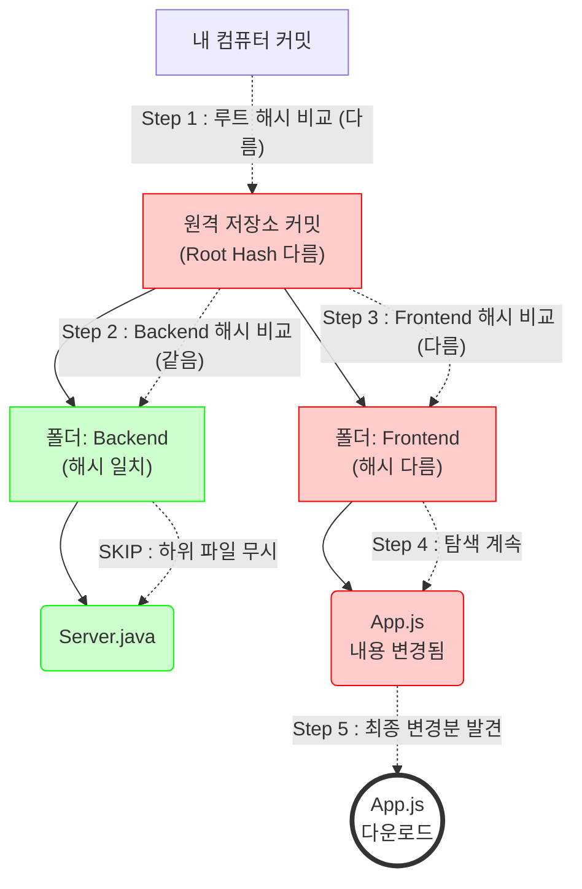

# 가용성관련

- 카카오 데이터 센터 화재로 본.. 교훈
    1. 계란을 한 바구니에 담기 (SPOF) single point of failure
        - 카카오는 데이터를 여러 곳에 복제해주긴함.. 하지만 `작업용 도구` `서버 제어 시스템` 등의 핵심 인프라가 판교 데이터센터에 집중되어 있었음
            - 데이터 사본이 서울 - 부산 등의 다른 곳에 있어도 연결해줄 서비스가 판교에 있으니.. 별 의미가 없었음
            - 수동으로 부산의 데이터를 서울로 끌어오는 등의 번거로운 행위가 필요했다.
    2. 가용성 붕괴와 수동복구 문제
        - 화재로 판교 노드들이 한꺼번에 이탈 → 남아있는 노드들이 폭증하여 트래픽을 감당하지 못함.
        - 시스템이 자동으로 다른 지역 서버로 넘어가야하는데 ( failover ) → 자동화가 안되어 있었음

> 뭘 말하고자하는 건가?
>
> - 안정 해시나 N 개 서버 다중화가 `데이터 안 잃어버림` 의 레벨 그 이상임
> - 물리적으로 독립적으로 N = 3 복제시 해당 서버들이 같은 전력망을 쓰는지 안쓰는지도 중요하다.
> - 시스템이 알아서  key0를 다른 s2 s3 서버에서 찾아오도록 설계가 되어야함.
> - DR 이 정말 중요한데 → 일부러 장애내기 ( 카오스 엔지니어링 ) 를 해보는 것이 중요

# 비일관성 해소

- 버저닝 관련인데..
- 대부분은 안한다고함, 데이터가 돈이나 UX 와 직렬된 AP 시스템의 경우 반드시 한다고함
- 일단 90 % 이상의 실무는 Last Write Wins 를 사용한다.
    - 무조건 마지막 요청이 다 덮는거임
- 10% 의 경우 데이터가 사라지면 큰일나는 서비스의 경우

  ### 아마존에서의 장바구니

    - 코드레벨에서 충돌 해소를 위해 `의미적 화해` 라는 로직을 짠다고함.

    ```mermaid
    sequenceDiagram
        participant C as Backend Server (App Logic)
        participant DB as Distributed DB (Vector Clock 사용)
    
        C->>DB: get("cart_123")
        DB-->>C: [v1: {맥북, Sx:2}, v2: {아이폰, Sy:1}] (충돌 발생!)
        
        Note over C: [백엔드 코드 개입]<br/>비즈니스 로직: 두 리스트를 합침 (Set Union)
        C->>C: merged_data = {맥북, 아이폰}
        
        C->>DB: put("cart_123", merged_data, new_v([Sx:2, Sy:1, Sz:1]))
        DB-->>C: ACK (성공)
    
    ```

    1. 유저가 비행기 모드에서 물건 A 를 담고, 다시 와이파이를 잡았을 경우 || 다른 기기에서 담은 물건 B 와 충돌
        1. LWW 면 나중에 담은 B만 남게됨 → 매출의 손실이라고 여겨짐
    2. 아마존은
        1. 코드 레벨에서 합친다고함.
            1. A 와 B 작업에서 골라진 상품들중에 중복제거후 → 벡터 시계로 업데이트 → `합쳐진 새 버전` 임을 명시함.
            2. 전부 장바구니에 담아짐

## 영구 장애난 경우 - 머클트리

- 만약 데이터 사본의 데이터가 너무 많이 틀어진 경우 .. 10억개의 데이터를 전수 조사하는 경우 비교하는 것 자체가 미친거임
- GIT 에서도 내부적으로 `git pull` 을 사용하는 경우 프로젝트 전체 파일을 다 다운로드 하는 것이 아님
    - 변경된 파일만 들고온다!. GIT 내부에서도 머클 트리 사용 이름 ㅈ간지네 ㅇㅈ ㅇㅇㅈ
- 동작
    1. 데이터 쪼개기 (버킷) : 10억개의 데이터를 100만 개의 버킷에 나눠 담기
    2. 지문 찍기 : 바구니 하나 해시값을 만듬 ㅇㅇ → 버킷 a → 해시값 `a1b2`
    3. 트리 만들기 : 해시값 2개를 합쳐서 부모 해시 만들기. 이걸 루트까지 반복함



1. git 에서 backend 폴더안에 뭐 파일이 수천개가 있던 수만개가 있던
    1. 내부의 파일이 변경된점이 있다면 해당 폴더에 대한 해시값이 다름.
    2. 해시가 같으면 10GB 든 더 넘든 볼 필요없다고 판단
2. 특정 폴더에 대해 해시값이 다르다면
    1. 내 폴더의 해시값과 다른 폴더나 파일만 탐색 LOG N search
- 분산 키도 해당 방식으로
    - DB 의 버킷 비교를 하는거임
        - 트리구조로 되어 있는 데이터간의 탐색으로 다른점만 특정 서버와 동기화하는 방식

---

흠.. 실제로 구현해보고싶음..
