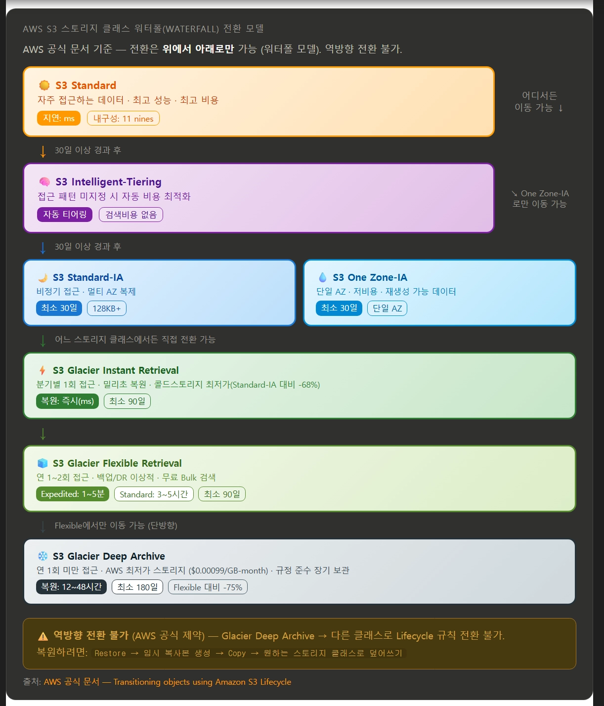
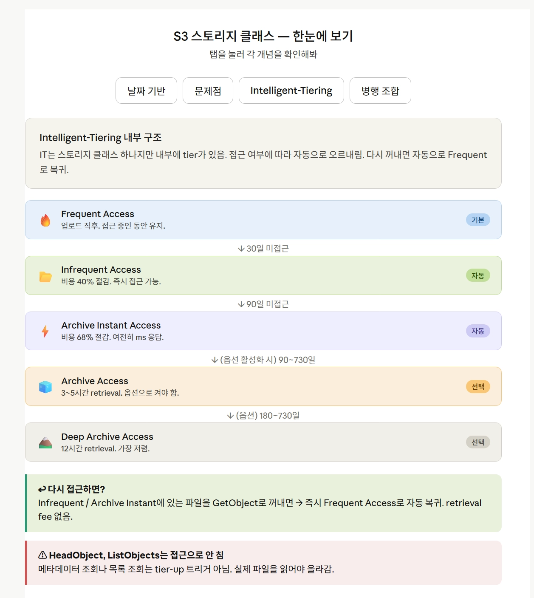
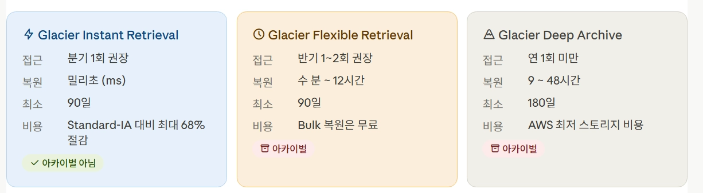
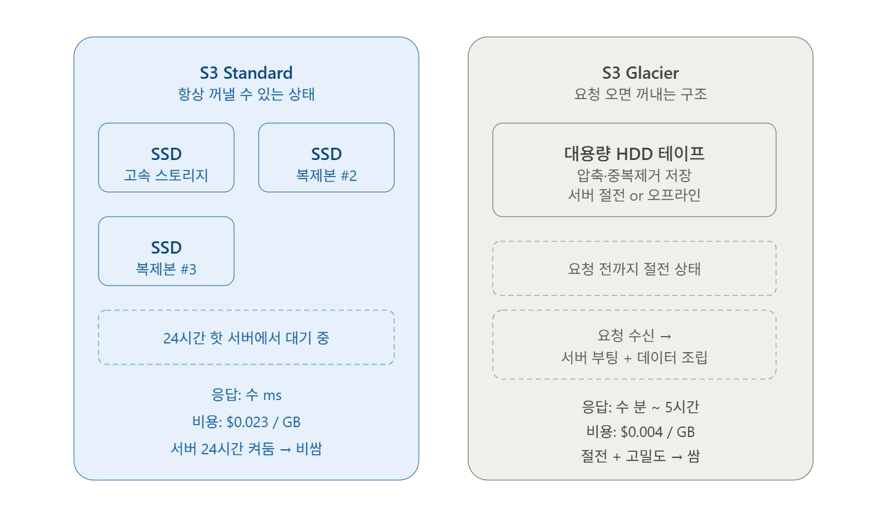

## 데이터를 어떻게 콜드 스토리지로 옮기는것인지?

### S3 스토리지 클래스의 전환 경로



1. s3 Standard 에 파일이 초기에 저장됨
   1. 자주 쓰는 데이터 이기에, ms 단위의 지연이 존재하고, 내구성도 11 nines ⇒ 99.9999999 % → 연간 손실 파일 (10억개 기준으로) 0.001 개 정도개 손실된다고함.
      1. 사실상 거의 없는 수준
2. 무조건 아래로만 흐르는 데이터이고, 역으로 연어같이 폭포를 거스를 순 없음.
3. Glacier 의 경우 3가지 종류가 존재한다

   **S3 Glacier 3종 상세 비교 (AWS 공식 기준)**

   | **항목** | ⚡ Glacier Instant | 🧊 Glacier Flexible | ❄️ Deep Archive |
          | --- | --- | --- | --- |
   | **복원 속도** | **밀리초(즉시)** | 1~5분 / 3~5시간 / 5~12시간 | **12~48시간** |
   | **최소 보관 기간** | 90일 | 90일 | **180일** |
   | **접근 빈도** | 분기 1회 | 연 1~2회 | 연 1회 미만 |
   | **비용 절감 (vs Standard-IA)** | **최대 68% ↓** | 더 저렴 | **$0.00099/GB ($1/TB)** |
   | **실시간 접근** | ✓ 가능 | ✗ (복원 후 임시 복사본) | ✗ (복원 후 임시 복사본) |
   | **최소 객체 크기** | 128KB | — | — |
   | **이상적 사용처** | 의료 이미지, 뉴스 자산즉시 접근 필요 아카이브 | 백업, DR장기 아카이브 | 규정 준수 (7~10년+)금융·의료·공공 |

   출처: [AWS 공식 문서 — Understanding S3 Glacier storage classes](https://docs.aws.amazon.com/AmazonS3/latest/userguide/glacier-storage-classes.html)

### 업로된 파일이 시간에 따라 어느 스토리지 클래스로 이동하는지 확인해보기

- S3 에는 라이프 사이클 정책을 별도로 지정할 수 있다.
    - S3 Lifecycle configuration 이라고하는데, S3 가 특정 오브젝트 그룹에 자동으로 적용할 액션을 정의한 규칙의 집합임.
    - 크게 2가지 존재함.
        - Transition actions → 오브젝트를 다른 스토리지 클래스로 이동
        - Expiration actions → 오브젝트를 삭제시

```jsx
#
라이프사이클
적용
aws
s3api
put - bucket - lifecycle - configuration \
  --bucket
my - bucket \
  --lifecycle - configuration
file://lifecycle.json
```

```jsx
{
    "Rules"
:
    [
        {
            "ID": "logs-tiering-down",
            "Status": "Enabled",
            "Filter": {"Prefix": "logs/"},
            "Transitions": [
                {"Days": 30, "StorageClass": "STANDARD_IA"},
                {"Days": 90, "StorageClass": "GLACIER"}
            ],
            "Expiration": {"Days": 365}
        }
    ]
}
```

- 이런식으로 단순 날짜로만 설정도 가능하고.
- 근데 단순 날짜로만 하는거면 자주 쓰는 파일도 클래스를 강제로 내려버리는거 아닌가?
    - 맞음.. 저런 단순한 날짜 기반의 경우 매우 별로임.
- s3 자체에서 intelligent-tiering 이라는 구조를 가져간다고함.

  

    - 이런식으로 날짜 접근에 따라 티어를 전환하지만, IT 옵션을 활성화도함
        - 그러면 2티어나 3티어에 있어도, S3 자체 IT 옵션이 알아서 1티어로 복귀시킴.
    - 다만, 단순 로그성의 경우 해당 작업이 불필요하기에, `/log` 폴더안에 있으면 뭐 30일은 2티어로.. 90일은 3티어로.. 365일은 어디로.., 이후에는 Gracier = cold warehouse
      로 이동..

### Glacier 는 어떤식으로 동작하는건지 의문..

- 일단 왜 싼지, 왜 느린지 모르겟음
    - 일단 Glacier 에는 3가지 종류가 있음

      

        - 아카이벌이 아닌 경우 → 실시간 접근이 가능함 → 근데 일반
        - 아카이벌의 경우 → 실시간 접근 자체가 불가능함.
            - 복원도 일반적인 방식으로 불가능해짐.
        - Glacier Instant Retieval 은 왜 같은 glacier 계열인데 아카이벌이 아닌거지
            - 얘는 실시간으로 접근이 가능하긴한데, 동작 방식 자체는 `Standard-IA` 와 동일.
            - 더싼데,, 스토리지 비용이 더 낮은 대신 꺼낼 때 retrieval fee 가 더 높은 구조임.
    - Standard 의 경우 vs Glacier 의 경우

      

        - HDD 로 구성되어 있고, 핫 서버가 아님
        - 요청 전까지 서버가 최대 절전 상태임 → 내가 너 좀 쓸게 ^^ 하면 → 켜고, 요청 받고, 데이터를 조립하는 행위를 하는데
            - 응답이 수분 ~ 5 시간까지나 소모;
            - AWS 입장에서는 요금을 싸게받고, 컴퓨팅 비용을 아끼니 뭐 소비자 입장에서도 장기 저장소로는 적합..
        - 그리고 파일도 단건으로 저장되는게 아니라, 작은 파일을 하나의 덩어리로 묶어서 저장처리함.
