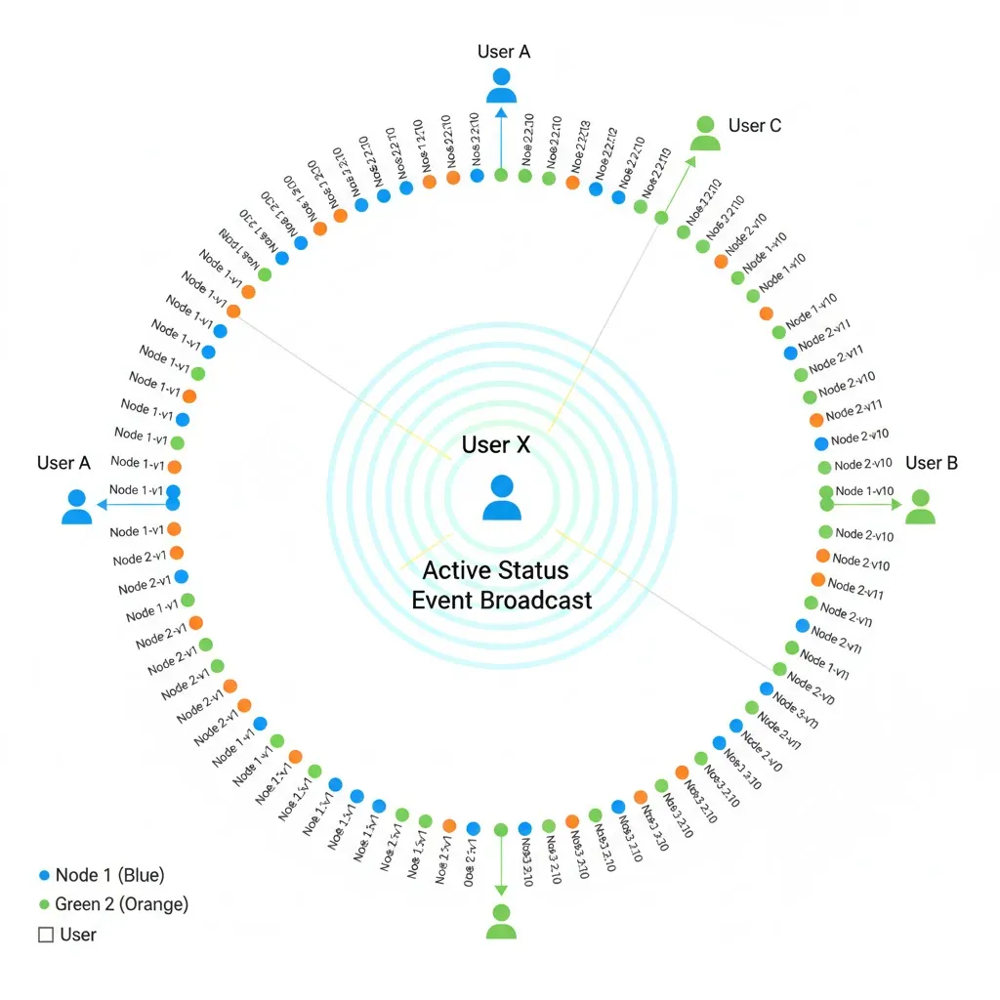

# 책의 내용 정리

일반적인 캐시의 키를 여러대의 서버대에 저장할때 일반적으로 모듈러(나머지) 함수를 이용해 저장한다고 치자, 이때 1번 서버가 죽으면 대부분의 데이터가 없는 캐시서버에 접속한다. 대규모 캐시 미스 발생. 안정 해시는 이 문제를 효과적으로 해결하는 기술

k/n의 키만 재배치하는 기술

k : 키의 개수

n : 슬롯의 개수

참고 해시함수 : 가변길이의 문자열을 고정길이의 문자열로 변환하는 함수. 입력 x에 대하여 f(x)=y일 경우, 함수가 여려번 실행된다고 해도 같은 결과를 보장한다.

이런 안정 해시 알고리즘의 기본 절차는 아래와 같다.

1. 서버와 키를 균등 분포 (uniform distribution) 해시 함수를 사용해서 해시 링에 배치
2. 키의 위치에서 링을 시계 방향으로 탐색하다 만나는 최초의 서버가 키가 저장될 서버

# 책 참고문헌 해석하면서 알게된 자료 정리

## **Discord는 어떻게 Elixir를 사용하여 동시 접속 사용자 500만 명을 수용하도록 확장했을까요?**

https://discord.com/blog/how-discord-scaled-elixir-to-5-000-000-concurrent-users

### elixir는 진짜 동시성 처리에 성능이 뛰어난가? 벤치마크 자료 확인

https://www.erlang-solutions.com/blog/comparing-elixir-vs-java/

위 자료에 따르면 elixir은 java와 같은 조건에서 아래 와같은 차이를 보였다.

구글 컴퓨트 노드

- CPU 정보: AMD EPYC 7B12
- 사용 가능한 코어 수: 8
- 사용 가능한 메모리: 31.36GB

5000개이상의 동시성 과제를 처리하며, 충분히 빠른 속도로 동작

https://themindstudios.com/blog/why-choose-elixir-for-your-project/

- elixir는 actor model의 사용으로 동시성이슈(데드락 이슈 없음. 복잡한 락 메커니즘 필요 없음.)를 해결.
  - 액터 모델은 상태를 공유하지 않으므로 복잡한 락 메커니즘 없이도 동시성을 안전하게 처리합니다.

### 그렇다면 디스코드는 어디서 어떤 타이밍에 consistent hashing 을 적용하였는가?

#### 1. 핵심 활용 포인트: 실시간 세션 관리 (Gateway)

Discord는 사용자가 접속하면 WebSocket 연결을 유지하는 **Gateway 서비스**를 운영합니다. 이때 특정 사용자의 연결이 어느 서버 노드에 할당될지를 결정할 때 컨시스턴트 해싱을 사용합니다.

- **상태 유지(Stateful):** 각 서버는 연결된 클라이언트의 세션 정보를 들고 있어야 합니다.
- **노드 추가/제거 시 영향 최소화:** 서버 한 대가 죽거나 트래픽 증가로 새 서버를 투입할 때, 일반적인 `hash(user_id) % n` 방식을 쓰면 `n`이 변하는 순간 거의 모든 연결이 끊기고 재접속 대란(Thundering Herd)이 일어납니다.
- **해결:** 컨시스턴트 해싱을 사용하면 서버가 추가/삭제되어도 **해당 노드에 할당되었던 최소한의 연결만 재배치**하면 됩니다.

#### 2. 메시지 전송 작업의 분배
- 메시지 전송 작업(이벤트)을 워커노드에 분배할때 안정해시를 활용.

12시방향 userA, 6시방향 사람, 그리고 노드의 색깔은 무시하고 봅시다.

- userX가 활성화상태야를 길드내의 유저들에게 이벤트를 전달할때 consistent hashing을 사용한다.
    - 따라서 얻을수 있는 장점
        1. 혹시나 처리할 프로세스의 수가 증가하거나 감소할때 최소한의 유저들에(키만)만 영향이 가도록(키의 재배치. 키의 재배치중 메시지 전달이 원할하지 않을 가능성) 처리 가능.

#### 3 Manifold의 작동 방식
- (3단계, 참고용. 2번의 부연설명. 블로그 url의 Inspired by a [blog post](http://www.ostinelli.net/boost-message-passing-between-erlang-nodes/) about boosting performance of message passing between nodes, [Manifold](https://github.com/hammerandchisel/manifold) was born 의 해석자료.)

노드 간 메시지 전달 성능 향상에 관한 한 블로그 게시물에서 영감을 받아 **Manifold**가 탄생했습니다. Manifold는 메시지를 보낼 대상인 PID(Erlang 프로세스 식별자)들의 원격 노드로 메시지 발송 작업을 분산시킵니다. 이를 통해 메시지를 보내는 프로세스가 `send/2` 함수를 호출하는 횟수가 관련된 원격 노드의 개수를 초과하지 않도록 보장합니다.

Manifold의 작동 방식은 다음과 같습니다. 우선 PID들을 각각의 원격 노드별로 그룹화한 뒤, 해당 노드들에 존재하는 `Manifold.Partitioner`로 메시지를 보냅니다. 그 후, 이 분배기(Partitioner)는 `:erlang.phash2/2`를 사용하여 PID들을 **일관되게 해싱(Consistently Hashing)**하고, 이를 CPU 코어 수에 맞춰 그룹화하여 하위 워커(Child workers)들에게 전달합니다. 마지막으로 이 워커들이 실제 프로세스들에게 메시지를 발송합니다.

이러한 구조는 분배기에 과부하가 걸리지 않도록 보장하면서도, 기존 `send/2` 함수가 보장하던 **선형성(Linearizability, 작업의 순서가 뒤바뀌지 않는 성질)**을 그대로 유지합니다. 이 솔루션은 사실상 기존의 `send/2`를 그대로 대체하여 바로 사용할 수 있는 수준(Drop-in replacement)이었습니다.

Inspired by a [blog post](http://www.ostinelli.net/boost-message-passing-between-erlang-nodes/) about boosting performance of message passing between nodes, [Manifold](https://github.com/hammerandchisel/manifold) was born. Manifold distributes the work of sending messages to the remote nodes of the PIDs (Erlang process identifier), which guarantees that the sending processes at most only calls send/2 equal to the number of involved remote nodes. Manifold does this by first grouping PIDs by their remote node and then sending to Manifold.Partitioner on each of those nodes. The partitioner then consistently hashes the PIDs using :erlang.phash2/2, groups them by number of cores, and sends them to child workers. Finally, those workers send the messages to the actual processes. This ensures the partitioner does not get overloaded and still provides the linearizability guaranteed by send/2. This solution was effectively a drop-in replacement for send/2: