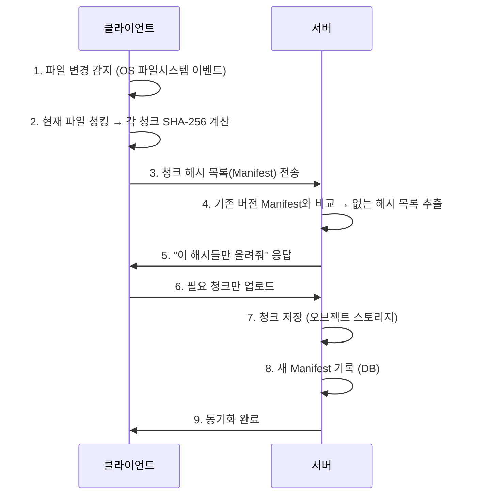

# 블록 저장소 서버 (Block Storage Server)


## 1. 블록 저장소란 무엇인가

블록 저장소 서버(Block Storage Server)는 **파일을 고정/가변 크기의 블록(청크)으로 나눠서 저장·관리·동기화**하는 시스템이다.

Dropbox, Google Drive, iCloud가 채택한 방식으로, 단순히 "파일 서버"가 아니라 아래 세 가지를 동시에 해결한다:

| 문제 | 해결책 |
|------|--------|
| 파일 전체 재전송의 비효율 | 변경된 블록만 전송 (델타 동기화) |
| 동일 파일의 중복 저장 | 해시 기반 중복 제거 (Deduplication) |
| 버전 이력 관리 | 청크 목록(Manifest)으로 버전 표현 |

### 왜 이 구조가 인상적인가?

> 1GB 파일에서 단 1바이트만 수정해도 기존 방식이라면 1GB 전체를 다시 업로드해야 한다.  
> 블록 저장소 방식은 **변경된 4MB 청크 하나만 전송** → 전송량 99.6% 절감.

---

## 2. 핵심 아이디어: 파일을 청크로 쪼갠다

### 기본 개념

```
[원본 파일 32MB]
       ↓ 분할
[청크1: 4MB] [청크2: 4MB] [청크3: 4MB] ... [청크8: 4MB]
       ↓ 각 청크 해시 계산
hash1 = SHA256(청크1)  →  "a3f9..."
hash2 = SHA256(청크2)  →  "b2e1..."
...
```

각 청크는 **SHA-256 해시값**으로 유일하게 식별된다. 내용이 같으면 해시가 같으므로:
- 이미 서버에 있는 청크 → 전송 안 함
- 없는 청크 → 전송

### 파일 버전 = 청크 해시 목록 (Manifest)

파일 자체를 저장하는 게 아니라, **청크 해시의 순서 있는 목록**을 저장한다.

```
파일 v1의 Manifest:
["a3f9...", "b2e1...", "c7d4...", "d1e8..."]

파일 v2의 Manifest (청크3만 수정):
["a3f9...", "b2e1...", "new_hash_f3a2...", "d1e8..."]
```

복원할 때는 Manifest의 순서대로 청크를 가져와 이어 붙이면 된다.

---

## 3. 청킹 전략 — 어떻게 쪼갤 것인가

### 3-1. 고정 크기 청킹 (Fixed-size Chunking)

파일을 N바이트 단위로 기계적으로 분할. 구현이 단순하다.

```
[ABCDEFGH...] → [ABCD][EFGH][IJKL]
                 4B    4B    4B
```

**문제: Boundary Shift Problem**

문서 앞에 2바이트("XX")를 삽입하면:

```
삽입 전: [ABCD][EFGH][IJKL][MNOP]
삽입 후: [XXAB][CDEF][GHIJ][KLMN][OP]
              ↑     ↑     ↑     ↑
           모두 다른 해시 → 전체 재업로드
```

단 2바이트를 삽입했는데 **모든 청크의 경계가 밀려 해시가 바뀐다.** 델타 동기화 효과가 없어진다.

---

### 3-2. 가변 크기 청킹 — Content-Defined Chunking (CDC)

**파일 내용을 보고 자연스러운 경계를 찾는다.**  
`Rabin Fingerprinting` 또는 `FastCDC` 알고리즘을 사용한다.

---

#### Rabin Fingerprinting 동작 원리

48바이트짜리 슬라이딩 윈도우가 파일 위를 1바이트씩 이동하면서, 윈도우 안의 내용을 해시값 하나로 압축한다. 그 해시값의 하위 13비트가 전부 0이 되는 순간 경계를 설정한다.

```
파일 바이트열:
[ A B C D E F G H I J K L M N O P Q R ... ]
  [←────────── 48바이트 윈도우 ──────────→]
  해시 계산 → 0110100101...0011001  → 하위 13비트 확인 → 아니면 패스

  → 1바이트 이동
    [←────────── 48바이트 윈도우 ──────────→]
    해시 계산 → 1001011010...0000000000000  → 하위 13비트 전부 0!
                                                      → 여기서 청크 경계!
```

13비트가 모두 0일 확률은 1/8192 (2의 13 ) → 평균 8KB마다 경계가 자연스럽게 발생한다.

중요한 점은 **경계가 절대 위치(몇 번째 바이트)가 아니라 주변 48바이트의 내용으로 결정**된다는 것이다.

```
핵심 수식:
fp = (fp << 1) XOR rabin_table[data[i]]        ← 새로 들어온 바이트 반영
             XOR rabin_table[data[i - window]]  ← 빠져나간 바이트 제거

if (fp & MASK == 0):  // MASK = 0x1FFF (하위 13비트)
    경계 설정!
```
* fp : fingerprint : 48바이트를 숫자 하나로 압축한 것
* MASK : 하위 몇 비트를 볼지 정하는 필터, 여기선 하위 13비트

슬라이딩 윈도우가 1바이트 이동하면 딱 두 가지 변화만 생긴다.

```
이동 전: [ A B C D E F G H ]
이동 후: [ B C D E F G H I ]
           ↑ A가 빠짐        ↑ I가 들어옴
```

매번 48바이트를 전부 다시 해시하는 대신, 들어온 바이트를 더하고 나간 바이트를 빼는 방식으로 fp를 업데이트한다. `rabin_table`은 바이트값(0~255)마다 미리 계산해둔 해시 기여값 배열이라 실제 연산은 배열 인덱스 조회 수준으로 빠르다.

`fp & MASK == 0` 은 fp의 하위 13비트가 전부 0인지 확인하는 연산이다.

```
MASK = 0x1FFF = 0000 0001 1111 1111 1111 1111  (하위 13비트만 1)

fp   = 1011 0110 1010 0000 0000 0000
MASK = 0000 0001 1111 1111 1111 1111
AND  = 0000 0000 0000 0000 0000 0000  → 0 → 경계!

fp   = 1011 0110 1010 0011 0101 1001
MASK = 0000 0001 1111 1111 1111 1111
AND  = 0000 0000 0000 0011 0101 1001  → 0 아님 → 패스
```

하위 13비트가 전부 0일 확률은 1/2¹³ = 1/8192 이므로, 평균 8KB마다 경계가 발생한다. MASK의 비트 수를 늘리면 경계가 드물어져 청크가 커지고, 줄이면 청크가 작아진다.
전체 파일을 다시 해시하지 않고, 들어오고 나가는 바이트만 XOR로 업데이트하기 때문에 연산이 매우 빠르다.

---

#### CDC의 핵심 장점 — 경계 안정성

앞에 내용이 추가되더라도 경계가 밀리지 않는 이유를 단계적으로 보면:

```
원본 파일:
바이트: [ ...서론 내용... | 경계A ][ ...본론 내용... | 경계B ][ ...결론... | 경계C ]
                          ↑                          ↑                      ↑
               이 위치의 48바이트가          이 위치의 48바이트가    이 위치의 48바이트가
               특정 해시 패턴 만족           특정 해시 패턴 만족     특정 해시 패턴 만족


앞에 "추가 서론" 삽입 후:
바이트: [ 추가서론+...서론... | 경계A' ][ ...본론 내용... | 경계B ][ ...결론... | 경계C ]
                               ↑                          ↑                      ↑
                    첫 청크는 내용이 바뀌어서         본론 바이트열은 그대로       결론도 그대로
                    경계 위치가 살짝 달라질 수 있음    → 경계B 그대로 유지          → 경계C 그대로 유지
```

삽입의 영향이 첫 번째 청크 안에서 흡수된다. 두 번째 청크부터는 바이트 내용이 동일하므로 윈도우 해시값도 동일하고, 경계도 그대로다.

```
결과:
  청크1: 변경됨 → 재업로드 필요
  청크2: 동일   → 서버에 이미 있음, 재사용
  청크3: 동일   → 서버에 이미 있음, 재사용
```

**첫 번째 청크만 재업로드, 나머지는 재사용.**

---

#### 고정 크기 청킹과 비교

```
고정 크기: 위치로 자른다
  → 앞에 뭔가 추가되면 모든 바이트가 뒤로 밀림
  → 모든 청크 경계가 이동 → 전체 재업로드

CDC: 내용으로 자른다
  → 경계는 주변 48바이트 내용이 결정
  → 추가된 내용이 첫 청크 안에서 흡수되면
  → 이후 청크는 내용이 같으니 경계도 같음
```
### 3-3. 청크 크기 선택 — 설계 결정 포인트

청크 크기는 단순한 숫자가 아니라 **시스템 전체 성능을 결정하는 핵심 파라미터**다.

| 청크 크기 | 장점 | 단점 | 적합한 케이스 |
|-----------|------|------|--------------|
| 4KB ~ 256KB | 세밀한 변경 감지, 높은 중복제거율 | 메타데이터 폭발 (청크 수↑) | 코드, 소형 텍스트 파일 |
| **4MB ~ 8MB** | **균형점, 실전에서 가장 많이 사용** | - | **일반 문서, 범용** |
| 64MB+ | 메타데이터 최소화 | 변경 감지 부정확, 작은 수정도 큰 전송 | 대형 바이너리, 영상 원본 |

> **실제 Dropbox**: 4MB 고정 청킹 + 파일 타입별 최적화  
> **Google Drive**: 256KB ~ 10MB 가변 CDC 방식

---

## 4. 델타 동기화 — 변경된 청크만 전송한다

### 4-1. 전체 프로토콜 흐름



### 4-2. 서버 측 델타 비교 로직 (핵심)

```java
public List<String> getChunksToUpload(List<String> oldManifest, List<String> newManifest) {
    Set<String> existingChunks = new HashSet<>(oldManifest);
    
    return newManifest.stream()
            .filter(h -> !existingChunks.contains(h))
            .collect(Collectors.toList());
}

/** 예시
old = ["a3f9", "b2e1", "c7d4", "d1e8"]
new = ["a3f9", "b2e1", "NEW1", "d1e8"]  # 청크3만 변경

get_chunks_to_upload(old, new)
# → ["NEW1"]  (전체 4개 중 1개만 업로드)
*/
```
