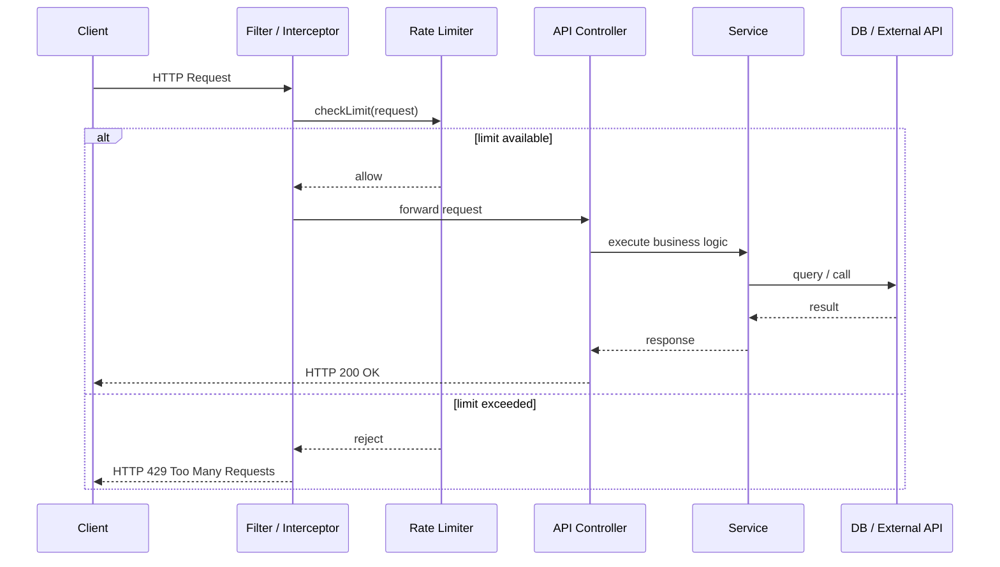
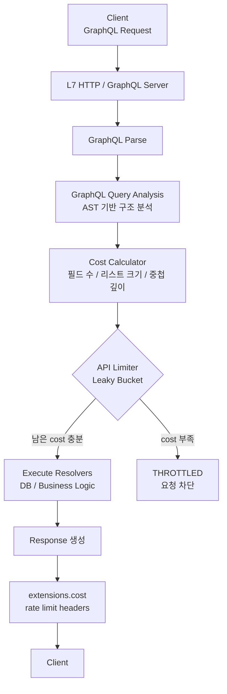

## 왜 API Limiter가 필요한가

API 서버를 운영하다 보면
“요청이 많아지면 서버를 늘리면 되지 않을까?”라는 생각을 하게 된다.

하지만 실제로는 모든 요청이 동일한 비용을 가지지 않는다.
특정 요청은 DB, 외부 API, 복잡한 연산을 동반하며 서버 리소스를 급격히 소모한다.

특히 외부 API를 호출하는 서버나,
관리자 권한 API를 제공하는 서버에서는
요청 수가 아닌 처리 비용 기준의 제어가 필요해진다.

이 지점에서 API Rate Limiter는 선택이 아니라 필수에 가깝다.

---

## Rate Limiting의 기본 개념

Rate Limiting은 단순히 “요청을 막는다”는 개념이 아니다.

* 서버를 보호하고
* 장애 전파를 막으며
* 시스템을 예측 가능한 상태로 유지하기 위한 장치다

Limiter는 보통 Controller 이전 단계에서 동작하며,
허용된 요청만이 실제 비즈니스 로직에 도달한다.

---

## Leaky Bucket 알고리즘

Leaky Bucket은 이름 그대로 “물이 새는 양동이” 모델이다.
서버가 처리할 수 있는 요청의 흐름을 일정한 속도로 제한하는 데 목적이 있다.

* 요청은 양동이(bucket)에 순서대로 들어오고
* 양동이는 정해진 속도로 물을 배출(leak)한다
* 양동이가 가득 차면(capacity 초과) 새로운 요청은 거절된다

이 알고리즘의 핵심은 순간적인 트래픽을 얼마나 빨리 처리하느냐가 아니라,
서버가 감당 가능한 속도를 지속적으로 유지하는 것이다.

따라서 짧은 시간에 요청이 몰리더라도,
서버는 항상 동일한 처리 속도로만 요청을 흘려보내게 된다.


### Leaky Bucket에서 필요한 핵심 파라미터

Leaky Bucket은 구조가 단순한 대신,
몇 가지 필수 파라미터가 명확히 정의되어야 정상적으로 동작한다.

| 파라미터           | 의미                   |
| -------------- | -------------------- |
| `capacity`     | 양동이가 담을 수 있는 최대 요청 수 |
| `leakRate`     | 초당 처리(배출) 가능한 요청 수   |
| `bucket.size`  | 현재 대기 중인 요청 수        |
| `lastLeakTime` | 마지막으로 요청을 배출한 시점     |

이 값들이 있어야 다음과 같은 판단이 가능해진다.

* 서버는 최대 몇 개까지 요청을 버틸 수 있는가
* 서버는 초당 몇 개의 요청을 안정적으로 처리할 수 있는가
* 현재 요청이*즉시 처리 가능한지**, 아니면 거절해야 하는지

---

## Leaky Bucket pseudo Code

Leaky Bucket을 코드가 아닌 처리 흐름으로 보면 이해가 훨씬 쉽다.

```text
bucket.capacity = 100          # 최대 100개 요청까지 대기 가능
bucket.leakRate = 10 req/sec   # 초당 10개씩 처리 가능

onRequest():
    leak()                     # 먼저 시간 경과만큼 요청을 배출
    if bucket.size >= capacity:
        reject request         # 더 이상 담을 수 없으면 거절
    else:
        bucket.size += 1
        accept request         # 요청을 큐에 추가

leak():
    elapsed = now - lastLeakTime
    leaked = elapsed * leakRate
    bucket.size = max(0, bucket.size - leaked)
    lastLeakTime = now
```

여기서 중요한 점은
요청이 들어올 때마다 leak을 먼저 수행한다는 것이다.

이 과정이 없으면,
이미 시간이 지나 처리됐어야 할 요청이 계속 쌓여
불필요하게 요청을 거절하는 상황이 발생할 수 있다.

---


## 서버사이드 API Limiter 설계

Leaky Bucket은 클라이언트가 아닌 서버 관점의 알고리즘이다.

일반적인 서버사이드 구조는 다음과 같다.



Limiter는 Controller 이전 단계에서 요청을 차단한다.
이를 통해 서버 리소스 소모 자체를 방지할 수 있다.

---

## Shopify와 Leaky Bucket

Shopify는 손쉽게 온라인 쇼핑몰을 구축할 수 있게 해주는 대규모 전자상거래 플랫폼이다.

Shopify는 대규모 전자상거래 플랫폼을 운영하면서 API Rate Limit을 단순한 요청 횟수 제한이 아닌, 처리 가능한 리소스를 기준으로 설계했다. 
이 구조는 전통적인 Leaky Bucket 모델과 유사한 성격을 가진다.

Shopify의 Admin API, 특히 GraphQL Admin API는 요청 수를 직접 제한하지 않는다. 
대신 각 요청이 플랫폼 자원을 얼마나 사용하는지를 cost라는 값으로 계산하고, 이 cost를 기준으로 요청을 허용하거나 거절한다.

이 방식은 트래픽을 막기 위한 방어 수단이라기보다, 플랫폼 전체의 처리 흐름을 일정하게 유지하기 위한 제어 방식에 가깝다.

---

## Shopify가 Leaky Bucket 계열 모델을 선택한 배경

Shopify는 수많은 스토어가 동시에 사용하는 멀티 테넌트 환경이다. 이 구조에서는 다음과 같은 문제가 빈번하게 발생한다.

* 단순하지만 매우 자주 호출되는 요청
* 호출 횟수는 적지만 서버 부하가 큰 복잡한 쿼리
* 특정 스토어의 과도한 사용이 다른 스토어의 응답 속도에 영향을 주는 상황

요청 수만을 기준으로 제한할 경우, 실제 서버 부하와 Rate Limit 사이에 괴리가 발생한다. 가벼운 요청과 무거운 요청을 동일하게 취급하면, 상대적으로 비용이 큰 요청이 플랫폼 리소스를 빠르게 잠식할 수 있다.

이 문제를 해결하기 위해 Shopify는 요청이 소비하는 자원을 기준으로 제한하는 방식을 택했다. 이 구조는 일정한 처리 용량을 유지하고, 시간이 지남에 따라 용량이 회복되며, 비용이 큰 요청일수록 더 많은 용량을 소모한다는 점에서 Leaky Bucket 모델과 유사하다.

---

### REST와 GraphQL의 차이와 비용

GraphQL의 특징은 요청마다 호출되는 엔드포인트와,
그 안에서 실행되는 작업의 범위가 고정되어 있지 않다는 점이다.

REST API에서는 보통 엔드포인트마다 역할이 분리되어 있다.

- /orders
- /orders/{id}
- /orders/{id}/line-items

각 엔드포인트는 반환하는 데이터의 범위가 비교적 명확하기 때문에,
요청 1회가 서버에 주는 부하를 어느 정도 예측할 수 있다.

반면 GraphQL에서는 단일 엔드포인트를 통해,
클라이언트가 필요한 데이터 구조를 직접 정의한다.

```graphql
{
  orders(first: 50) {
    edges {
      node {
        id
        totalPrice
        lineItems(first: 50) {
          edges {
            node {
              title
              quantity
            }
          }
        }
      }
    }
  }
}
```


## Shopify GraphQL Rate Limit 구조

Shopify GraphQL Admin API의 Rate Limit 구조를 단순화하면 다음과 같이 표현할 수 있다.

```text
bucket.capacity = 1000            # 누적 가능한 최대 cost
bucket.refillRate = 50 cost/sec   # 초당 회복되는 cost

onGraphQLQuery(queryCost):
    if bucket.remaining < queryCost:
        reject request
    else:
        bucket.remaining -= queryCost
        execute query
```

각 GraphQL 쿼리는 내부적으로 cost를 계산받는다. 단순한 조회는 낮은 cost를 사용하고, 많은 필드나 중첩 구조, 대량의 노드를 조회하는 쿼리는 더 높은 cost를 사용한다.

### Shopify는 어떻게 cost를 판단할 수 있을까?

Shopify는 GraphQL 요청을 실제로 실행하기 전에 먼저 쿼리를 파싱하고 구조를 분석한다.
이 과정에서 어떤 필드가 요청되었는지, 리스트의 크기와 중첩 깊이는 어느 정도인지를 파악할 수 있다.

GraphQL은 스키마가 고정되어 있고 각 필드가 어떤 리소스와 연결되는지 명확하기 때문에,
쿼리를 실행하지 않고도 대략적인 처리 비용을 예측할 수 있다.

이렇게 계산된 cost는 API Limiter에 전달되어,
현재 남아 있는 처리 가능 용량과 비교된 뒤 요청의 실행 여부가 결정된다.
Limiter를 통과한 요청만 실제 비즈니스 로직과 데이터베이스 접근을 수행한다.

이로 인해 다음과 같은 효과가 발생한다.

* 요청 횟수는 적지만 무거운 쿼리가 시스템을 과도하게 사용하는 상황을 방지할 수 있고
* 병렬 요청이 많아도 전체 처리 속도가 급격히 변하지 않으며
* 클라이언트는 자연스럽게 쿼리를 단순하게 구성하도록 유도된다


### Cost 를 L7에서 판단하면 성능에 문제는 없을까?

처음에는 API Rate Limit이나 비용 판단이
패킷을 파싱하기 전, 더 낮은 OSI 계층에서 처리되는 것이 성능상 유리하지 않을까라는 생각이 들었다.
네트워크 레벨에서 미리 차단하는 방식이 더 효율적일 것처럼 보였기 때문이다.

하지만 GraphQL의 특성을 고려하면,
cost 판단은 L7(Application Layer)에서 이루어질 수밖에 없다.
쿼리의 무게는 HTTP 헤더나 네트워크 정보만으로는 알 수 없고,
요청 본문에 포함된 GraphQL 쿼리 구조를 분석해야만 판단할 수 있기 때문이다.

중요한 점은 이 과정이 실제 비즈니스 로직이나 데이터베이스 접근 이전에 수행된다는 것이다.
GraphQL 서버는 쿼리를 실행하지 않고,
AST 기반의 구조 분석을 통해 필드 수, 리스트 크기, 중첩 깊이만을 확인한다.
이 단계의 비용은 실제 쿼리 실행에 비해 매우 작다.

그 결과, 판단은 L7에서 이루어지지만
불필요한 DB 접근이나 무거운 연산을 사전에 차단할 수 있고,
전체 시스템 성능에 미치는 영향도 최소화된다.

즉, Shopify의 설계는
“더 낮은 계층에서 빠르게 막는 것”보다
“정확한 정보를 바탕으로 실행 전에 판단하는 것”을 우선한 선택이라고 볼 수 있다.

---

## 실무에서 얻은 인사이트

실무에서 느낀 점은 다음과 같다.

* Rate Limit은 요청 수보다 비용 기준이 더 현실적이다
* 병렬 처리는 Limiter를 전제로 설계해야 한다
* 외부 API를 호출하는 서버는 반드시 내부 Limiter가 필요하다
* 가중치를 예상할 수 있지만 정확한 시간을 측정하는 것은 어렵다.

Shopify의 사례는
“요청을 막는 정책”이 아니라
“시스템을 안정적으로 유지하기 위한 구조”에 가깝다.

---

## 마무리

Leaky Bucket은 복잡한 알고리즘이 아니다.

하지만 어디에, 어떤 기준으로 적용하느냐에 따라
시스템의 안정성은 크게 달라진다.

API Rate Limiter는 성능 최적화 이전에,
시스템을 지키기 위한 최소한의 안전장치라고 생각한다.